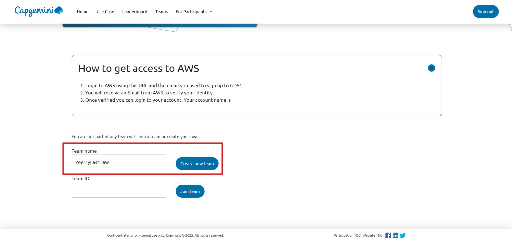
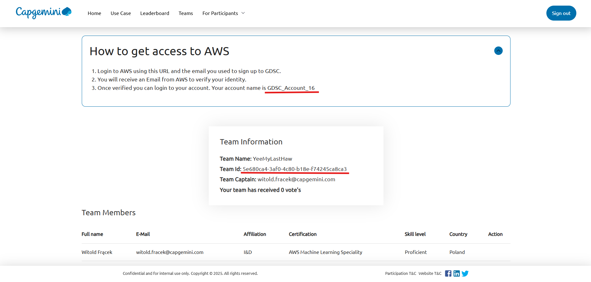

# Global Data Science Challenge: Green Agents of Change

We are hosting the 8th edition of the Global Data Science Challenge: Green Agents of Change. This year we’re teaming up with UNICEF to help young people drive climate action where it counts, through meaningful, sustainable careers.

## Our Focus

Empowering youth across Brazil to explore, discover, and pursue green and future-proof jobs.

## The Challenge

Collaborate with AI agents to sift through heaps of job descriptions and training opportunities across Brazil, match people to roles that fit their preferences and potential, and recommend concrete learning paths to get there.

That means:
- Retrieval over real data (not just model memory)
- Thoughtful matching and ranking
- Smart prompt engineering

Mistral LLM models will serve as brains for our AI agents. AWS is the cloud infra of choice for this challenge.

---

## Details

### # Data

The dataset will include three sets:

1. **Personas**: fictional beneficiaries with a profile, constraints, and objectives. Each persona is a Mistral agent with its own custom prompt and hosted on an AWS API endpoint for participants to interact with through their solution and fetch required details about the persona to be able to make a match with job/trainings/awareness recommendations.

2. **Jobs**: structured job offers in template JSON in Markdown format. These will be hosted on AWS S3 bucket.

3. **Trainings**: relevant training programs in template JSON in Markdown format. These will be hosted on AWS S3 bucket.

For each persona, participant solution should define an **expected gold output** indicating the correct outcome (jobs, trainings, or awareness).

{
  "id": "pers_001",
  "domain_focus": "Marketing",
  "age": 25,
  "education_level": "Bachelor's Degree",
  "years_experience": 2,
  "current_role": "Communications Officer",
  "skills": [
    {"name": "SEO", "level": 3},
    {"name": "Copywriting", "level": 2}
  ],
  "interests": [
    {"name": "Brand strategy", "weight": 0.7},
    {"name": "Data analytics", "weight": 0.3}
  ],
  "constraints": {
    "location": "Paris",
    "mobility": "low",
    "contract": "Permanent"
  },
  "reason_for_consult": "Wants to move into a marketing project manager role",
  "expected_output_type": "jobs"
}

## Data Schemas

### Persona
```json
{
  "id": "pers_001",
  "domain_focus": "Marketing",
  "age": 25,
  "education_level": "Bachelor's Degree",
  "years_experience": 2,
  "current_role": "Communications Officer",
  "skills": [
    {"name": "SEO", "level": 3},
    {"name": "Copywriting", "level": 2}
  ],
  "interests": [
    {"name": "Brand strategy", "weight": 0.7},
    {"name": "Data analytics", "weight": 0.3}
  ],
  "constraints": {
    "location": "Paris",
    "mobility": "low",
    "contract": "Permanent"
  },
  "reason_for_consult": "Wants to move into a marketing project manager role",
  "expected_output_type": "jobs"
}
```

**Skill levels**: scale 0 to 4 (0 = none, 4 = expert).  
**Possible constraints**: location, mobility, contract type, language, working hours, seniority, age.

---

### Job
```json
{
  "id": "job_001",
  "domain": "Marketing",
  "title": "Digital Marketing Project Manager",
  "seniority": "mid-level",
  "required_skills": [
    {"name": "SEO", "min_level": 3},
    {"name": "Project Management", "min_level": 2}
  ],
  "nice_to_have": [
    {"name": "HTML", "min_level": 1}
  ],
  "location": "Paris",
  "contract": "Permanent",
  "tasks": ["Coordinate digital campaigns", "Analyze KPIs"],
  "salary_band": "35-45k€",
  "language": "FR"
}
```

---

### Training
```json
{
  "id": "tr_001",
  "domain": "Marketing",
  "title": "Digital Project Management Training",
  "outcomes": [
    {"name": "Project Management", "target_level": 3},
    {"name": "SEO", "target_level": 4}
  ],
  "prerequisites": [
    {"name": "Project Management", "min_level": 1}
  ],
  "duration_weeks": 8,
  "format": "online",
  "language": "FR",
  "certification": true
}
```

---

## Matching Rules

### Hard Filters

A job is incompatible if:
- Seniority is insufficient.
- Location/mobility are incompatible.
- Required language not mastered.
- Domain different from `domain_focus` if `domain_lock: true`.
- Contract type or working hours not desired.

---

### Skill Coverage

```text
coverage = (# required skills satisfied) / (total required skills)
```

- A skill is satisfied if `level_persona ≥ min_level_job`.
- Compatible if `coverage ≥ 0.70` after passing hard filters.

## Determining the Expected Gold Output (V1)

### Case 1: Jobs

- Personas seeking a job.
- Apply hard filters and the **70% skill coverage rule**.
- `gold_type = jobs`
- `gold_items` = list of compatible jobs (possibly empty), sorted by coverage and interest alignment.
- Suggest jobs even if `coverage < 0.70`, along with trainings to fill skill gaps.
- Gold enriched with:

```json
{
  "persona_id": "pers_001",
  "gold_type": "jobs_with_upskilling",
  "items": [
    {
      "job_id": "job_001",
      "gap_skills": ["Project Management"],
      "trainings": ["tr_001"]
    }
  ]
}
```

---

### Case 2: Trainings

- Personas explicitly seeking to train.
- Identify their learning objectives.
- `gold_type = trainings`
- `gold_items` = trainings matching the objectives.

---

### Case 3: Awareness
- Minors (<16) or personas seeking general information.
- `gold_type = awareness`
- No recommendations required.

---

### Sample Gold File
```json
{"persona_id": "pers_tou_001", "gold_type": "trainings_only", "trainings": ["tr_tou_cultural_awareness_02", "tr_tou_problem_solving_02"]}
{"persona_id": "pers_tou_002", "gold_type": "jobs+trainings", "jobs": [{"job_id": "job_tou_010", "suggested_trainings": []}]}
{"persona_id": "pers_tou_003", "gold_type": "awareness", "gold_items": "too_young"}
{"persona_id": "pers_tou_004", "gold_type": "trainings_only", "trainings": ["tr_tou_multilingual_communication_02"]}
{"persona_id": "pers_tou_005", "gold_type": "trainings_only", "trainings": ["tr_tou_marketing_and_promotion_tourism__03"]}
```

---

### Additional Notes

- The solution will also be graded based on how **green** it is — i.e., optimal use of resources, LLM tokens, etc.
- The participant population is expected to be a mix of **technical and non-technical** individuals with varying degrees of coding experience.
- Relevant trainings will be provided **before** diving into the challenge.

Below are the sample trainings from last year:

# Tutorial 1: Set up your account for GDSC 2024

Welcome to the first tutorial of the 2024 GDSC: The Grade-AI Generation! The tutorials will teach you all the necessary steps to participate in (and hopefully win) the challenge. 
This first tutorial covers the (boring) groundwork that we need to cover before we can jump into the AI parts. It explains how to create an account, sign in, create and join a team and how to access AWS.

But before we jump in make sure you join the [GDSC Teams channel](https://teams.microsoft.com/l/team/19%3a4017a2e9af4942e7aa157d6ec9d751b4%40thread.skype/conversations?groupId=7d77d672-dff1-4c9f-ac55-3c837c1bebf9&tenantId=76a2ae5a-9f00-4f6b-95ed-5d33d77c4d61/) for all updates from the organisation team and meeting and connecting with other participants. This is also the place to ask questions if you are stuck.

Here is a quick overview of what we'll cover:

  - [1. Signing up and logging to the website](#1-signing-up-and-logging-to-the-website)
  - [2. Creating and joining a team](#2-creating-and-joining-a-team)
  - [3. Setting up your AWS accounts](#3-setting-up-your-aws-accounts)
  - [4. How to use AWS](#4-how-to-use-aws)
    - [4.1. Accessing GenAI Models with AWS Bedrock](#41-accessing-genai-models-with-aws-bedrock)
    - [4.2. Managing source code with AWS CodeCommit](#42-managing-source-code-with-aws-codecommit)
    - [4.3. Developing AI solutions with Sagemaker](#43-developing-ai-solutions-with-sagemaker)
    - [4.4. Keeping track of the costs](#44-keeping-track-of-the-costs)
  - [5. Running the tutorials](#5-running-the-tutorials)  
  - [6. Conclusion](#6-conclusion)
  - [7. Appendix -  Where to develop your solution](#7-appendix---where-to-develop-your-solution)
    - [7.1. With AWS Sagemaker](#71-with-aws-sagemaker)
    - [7.2. On your laptop](#72-on-your-laptop) 

## 1. Signing up and logging to the website:

The very first thing you need to do to participate in the GDSC is to sign up! Here's how:

1. Navigate to the GDSC Portal's Sign-up page - [https://gdsc.ce.capgemini.com/app/signup/](https://gdsc.ce.capgemini.com/app/signup/). Make sure to enter your Capgemini email. The full name is not mandatory to sign up, but it is necessary to receive a certificate of completion after the challenge. 
2. Once you Sign-up, you will receive an e-mail like the one shown below from gdsc.ce@capgemini.com.  
3. Please click on the Verification link provided in the e-mail. You will receive an error such as this. But do not worry, you can now login to the website.
   
4. To login to the website, navigate to the login page - [https://gdsc.ce.capgemini.com/app/login/](https://gdsc.ce.capgemini.com/app/login/) and enter your credentials. 
5. Once you login you will have access to the Resources - [https://gdsc.ce.capgemini.com/app/portal/resources/](https://gdsc.ce.capgemini.com/app/portal/resources/). The page has link to all the information and tutorials that you will be needing for the challenge. You can also access the Usecase page to learn more about the challenge. Feel free to explore the website for information about the current challenge and the past editions.

## 2. Creating and joining a team

The next step is to form or join a team. Every participant needs to be in a team to participate in a challenge. You have three options:
   * Create a team only for yourself
   * Create a team, find other people to join, share their team id with them. They will request to join and you can accept
   * Request to join an existing team

We highly recommend that you form a team with other participants. This will help you to share ideas, learn from each other and have a better chance of winning the challenge.
If you don't have a team, you can find other people in the GDSC Teams channel ['Looking for Team'](https://teams.microsoft.com/l/channel/19%3Aa32e03d38fc940ee9d4b20a7cc9e030d%40thread.skype/Looking%20for%20Team?groupId=7d77d672-dff1-4c9f-ac55-3c837c1bebf9&tenantId=76a2ae5a-9f00-4f6b-95ed-5d33d77c4d61). It's best to work with people in a similar timezone and with a similar motivation. If you really want to win make sure your teammates have the same goal. If you're here to learn and have fun, make sure your teammates are on the same page. Note that there can be up to 4 people in a team.
 
To actually create a new team you need to

1. Go to the 'My Team 'page - [https://gdsc.ce.capgemini.com/app/portal/](https://gdsc.ce.capgemini.com/app/portal/).

2. Enter your team name (keeping in mind that there is a prize for the 'best' name) and press the 'Create Team' button. 

3. Once a team is created, you are assigned a Team ID, which you can share with potential team members and ask them to join your team. You are also assigned an AWS account, in this example *AneTestAccount0008*

   
4. (Optional) To join a team, simply copy the team ID and paste it in the 'Join Team' section.  If you no longer wish to join a team, you can cancel your request. 
   
5. (Optional) The team lead can approve or decline requests from new members
   

6. (Optional) The team lead (i.e. the team creator) can remove members from the team. Keep in mind that there can be at most 4 members in a team. 

7. ⚠️ Warning for the Team Leads: If you delete the team, all members, permissions and resources in your AWS account will be destroyed. This potentially included the code and models you have been working on. Make sure you have a backup of your code before deleting the team.

## 3. Setting up your AWS accounts

AWS is an integral part of the GDSC. It is where you will be developing your solution and accessing the LLM models. You will be assigned an AWS account when you create a team. Here is how you can access your AWS account: 

1. Go to the [My Team](https://gdsc.ce.capgemini.com/app/portal/). In the *How to aget access to AWS* you can see the access link and your account name.

2. Login to your AWS account with the Capgemini email address that you used to sign up for the GDSC as the username [https://gdsc22.awsapps.com/start#/](https://gdsc22.awsapps.com/start#/)

   
   
3. You will receive an email from *no-reply@login.awsapps.com* with the verification code. Enter it and set your password.

   
   
4. You should now be logged into AWS and see the AWS Portal with your account.

   
   
   Click on *TeamAccess* to access your account!

5. (Optional) If you would like to work on your laptop you need to export the credentials. Click on *Access keys* and follow the instructions. We recommend that you go with *Option 1: Set AWS environment variables*. You need to paste the instruction in your terminal and then run the command `aws sts get-caller-identity`. If you see the response shown in the screenshot, you are all set. If it says the token is expired, refresh the AWS page and copy the credentials again

   

## 4. How to use AWS

Almost done! Now that you have access to AWS, let's see how you can use it for the GDSC.
In this section, we will cover the main services you will be using in the GDSC: Bedrock, CodeCommit, Sagemaker and Cost Explorer. 

Your screen should look like this when you log in.


But before we start, here are some general tips for using AWS:
* Make sure you are in N. Virginia region (look at the  top right)
* You can change language and the theme in the settings button to the left of the region
* On the top left, you can search for services


### 4.1. Accessing GenAI Models with AWS Bedrock

Large Language Models (LLM) are the core of the GDSC. We'll access them via AWS Bedrock. Search for Bedrock in the search bar and click on the service. Click on the button on the top left to open the panel. Your screen should look like this:


`Base models` lists all models that are available on AWS. For the GDSC, we gave you access to Claude 3 Haiku and Claude 3.5 Sonnet. You may use other models but will have to organize access and payment to them yourself.
The `Playgrounds` are perfect for testing out the different models. The `Chat` interface allows you to chat with the model, similar that the openAI chatGPT website. 

### 4.2. Managing source code with AWS CodeCommit

Source code is usually managed via a version control system like Git. AWS CodeCommit is a managed service that hosts secure Git repositories.

Search and navigate to the CodeCommit service to access the tutorials and code for the challenge. **As a change to the previous years you will also need the repository to submit a solution!**


To test your code before submitting a solution, you'll need to push it to the branch `test_submission`. 
To actually submit a solution you need to push the code to the branch `submission`. 
We'll show an example of how to do this in [tutorial 4](https://github.com/cg-gdsc/GDSC-7/blob/main/tutorials/Tutorial_4_Submitting_Your_Solution.ipynb).

### 4.3. Developing AI solutions with Sagemaker

AWS Sagemaker is a fully managed service that provides every developer and data scientist with the ability to build, train, and deploy machine learning models quickly. We'll use it to develop our AI solutions.

Like before, search for Sagemaker in the search bar and click on the service and click on `Notebooks` under `Applications and IDEs`. Your screen should look like this:


You will find 4 stopped notebooks created for your team, one for each team member. Align with your team member who will work on which notebook, then press the "Start" button to start your notebook and for around 5 min until the Status is a green "InService". Under the actions column, click on "Open JupyterLab" and you should see the following screen:


JupyterLab is already connected to the GDSC CodeCommit repository, the code can be found on the left side. You are able to pull and push the code from JupyterLab.

Note that you can edit the appearance of the environment in the Settings, for instance changing to dark mode or changing the language.

### 4.4. Keeping track of the costs

Finally, it is important to keep track of the costs of the AWS services you are using. Each teams gets a fixed budget every week. Developing **and** submitting a solution costs money. **If you spent more than your budget, you will not be able to access the services anymore for the rest of the week!** Hence, budget control is essential!

You can see a summary of your current monthly costs in the AWS overview in the main page when you log in.
For a more detailed view you can look at the  `Billing and cost management` service. On the main page, you can see a summary of the existing costs, and forecasted costs for the current month.

The `Cost explorer` tab on the left, is the best way to get down to the details. It looks like this:


On the right side, you can filter by time range, granularity and dimension. You can see the costs for the different services you are using. You can also see the forecasted costs for the month. Keep in mind that it takes around 1 day for the costs to be updated.

## 5. Running the tutorials

All that's left now it to do one final check that everything is working. We'll do this by opening the second tutorials.
Go back to Sagemaker, open your notebook and start JuypterLab as describer in section [4.3](#43-developing-ai-solutions-with-sagemaker).

In the left sidebar, you will see the `tutorials` folder. The first tutorial is this file. Open the second tutorial by clicking on `Tutorial_2_Data_Understanding.ipynb`. Your screen should look like this:


In the `Select Kernel` box click on *Select*. Scroll down to the first Python cell in the `Set up the environment` section.
Click in the cell and press `Shift + Enter` to run the cell. You should see the output of the cell below the cell.


And that's it! You are now ready to start the second tutorial.

## 6. Conclusion

In this tutorial you have learnt how to sign up for the challenge and form your team. You have been assigned an AWS account, where you have explored the code, coding environment, LLM models and costs.

Remember that you can always ask for help in the [GDSC Teams channel](https://teams.microsoft.com/l/team/19%3a4017a2e9af4942e7aa157d6ec9d751b4%40thread.skype/conversations?groupId=7d77d672-dff1-4c9f-ac55-3c837c1bebf9&tenantId=76a2ae5a-9f00-4f6b-95ed-5d33d77c4d61/) and that there is a community voted **special prize** for the team that helps other the most!

You are now ready for tutorial 2, where you will learn about the dataset for the challenge.

## 7 Appendix -  Where to develop your solution

We already touched on this previously, but let's go into more detail.
You can develop your solution in two ways: either locally on your own laptop or with AWS using AWS Sagemaker.

### 7.1. With AWS Sagemaker

To use AWS Sagemaker you will need to follow these steps:

- Start your notebook instance when you are ready to develop in Sagemaker as described in the [previous section]((#43-developing-ai-solutions-with-sagemaker))
- Use CodeCommit to manage your source code and submit solutions. We'll show how in [Tutorial 4](https://github.com/cg-gdsc/GDSC-7/blob/main/tutorials/Tutorial_4_Submitting_Your_Solution.ipynb)
- Remember to stop your instance when you are not using it to save costs. If not, it will be automatically be stopped if it's not in use for one hour

### 7.2. On your laptop

To work on your laptop you'll need to:

- Set up your development tools: code editor, terminal, git, aws cli library
- Export your AWS credentials as explained in the [section 3.5]((#3-setting-up-your-aws-accounts)) so you are authenticated to AWS
- Pull the code from the account's CodeCommit to your computer and push it when you are ready to test or submit


# **Tutorial 2** - Understanding the PIRLS dataset

Welcome in the next part of our tutorials for Global Data Science Challenge 2024. Today, we embark on a comprehensive exploration of our dataset for this year's GDSC, featuring the PIRLS 2021 dataset.
A solid understanding of the data is arguably the most important part of *any* data science project. The impact of data on the final results is usually higher than the impact of the choice of algorithm. The [data-centric AI](https://datacentricai.org/) is a great start to get deeper into the topic.

This tutorial is structured into three primary components: a video, a website, and this notebook. To begin, I recommend watching the [PIRLS 2021 video](https://youtu.be/jUv1QowWmqI?feature=shared), which provides a solid foundation on what this study encompasses. Following the video, visit the [PIRLS 2021 website](https://pirls2021.org/) to delve deeper and discover additional information about the study. After engaging with these resources, you'll be well-prepared to navigate through this notebook.

*If you're not watching our tutorial video and you are only reading this notebook, now is the perfect time watch [PIRLS 2021 video](https://youtu.be/jUv1QowWmqI?feature=shared) and browse through [PIRLS 2021 website](https://pirls2021.org/). Completing these steps is crucial for a thorough understanding of the study, which, in turn, will enhance your ability to follow along with the notebook. I strongly encourage you to familiarize yourself with the study before proceeding, to ensure a smooth and informed learning experience.*

The goal of the GDSC is to build AI agents that automatically answer complex questions about educational topics, utilizing the PIRLS 2021 data. 
This notebook is crafted to showcase the complexity of SQL queries that LLMs (Large Language Models) will ingeniously construct to navigate the dataset's depths. Moreover, it's designed to empower you with strategies for independently discovering the data you find most compelling. By illustrating both the advanced SQL capabilities required by LLMs and guiding you on how to embark on your data exploration journey, we aim to provide a comprehensive understanding of effective query formulation.

## Agenda

1. [Set up the environment](#set-up-the-environment) - Provides all the essential functions needed to configure the environment for developing and executing queries

2. [The database schema](#the-database-schema) - Describes the structure of the relational database
    - [The database overview](#the-database-overview) - Offers a high-level overview of the database schema, explaining the organization and relationships between different tables.

    - [Tables about student questionnaires](#tables-about-student-questionnaires) - Delves into the specifics of the tables related to student questionnaires.

    - [Tables about student achievement scores](#tables-about-student-achievement-scores) - Explores the specifics of the tables related to student achievement scores:

        - [Clarification - Student Score Entries](#clarification---student-score-entries) - Provides a detailed explanation of the `Student Score Entries` table, including the types of scores recorded and the significance of average and standard deviation metrics.

        - [Clarification - Benchmarks](#clarification---benchmarks) - Explains the `Benchmarks` table, focusing on how benchmarks are set for different scores and what they indicate about student performance.
    
    - [Tables about school, home, and curriculum questionnaires](#tables-about-school-home-and-curriculum-questionnaires) - Highlights key points for the tables related to school, home, and curriculum questionnaires.

    - [Table about teacher questionnaires](#table-about-teacher-questionnaire) - Highlights key points for the tables related to teacher questionnaires.
        
3. [Querying the database](#querying-the-database) - Demonstrates how to effectively extract meaningful insights from the database
    - [Show available tables](#show-available-tables)
    
    - [Understanding the content of a table](#understanding-the-content-of-a-table)

    - [Example graphs for visualizing data](#example-graphs-for-visualizing-data)

    - [What types of questions to expect during the challenge](#what-types-of-questions-to-expect-during-the-challenge)
    
4. [Conclusion](#conclusion) - Summarizes what we learned and how to proceed
  
5. [Appendix](#appendix) - Additional resources

    - [More example questions with SQL queries](#more-example-questions-with-sql-queries),

    - [VS Code](#vs-code) - Shows how to set up a notebook in the VS Code IDE

        - [Data Wrangler](#data-wrangler) - Presents the VS Code extension and how to install it. This is optional but highly recommended.
    

## Set up the environment

Firstly we install and import necessary python modules.


```python
# Installing necessary modules

!pip install psycopg2-binary pandas seaborn matplotlib
```


```python
import psycopg2 # module for connecting to a PostgreSQL database
import pandas as pd  # module for data manipulation and analysis

import seaborn as sns # library for visualization of data
import matplotlib.pyplot as plt # library for visualization of data

pd.set_option('display.max_colwidth', None) # display all the contents of a column
```

We define the login information for the database ...


```python
DB_ENDPOINT = 'INSERT DB URL HERE'
DB_PORT = '5432'
DB_USER = 'INSERT USER HERE'
DB_PASSWORD ='INSERT PASSWOERD HERE'
DB_NAME ='postgres'
```

... and some helper function  for database connectivity, query execution, and related operations. We'll use them later.


```python
def create_connection() -> psycopg2.extensions.connection:
    """
    Creates a connection to the PostgreSQL database. Uses the global variables DB_ENDPOINT, DB_PORT, DB_USER, DB_PASSWORD, DB_NAME.

    Returns:
        psycopg2.extensions.connection: A connection object to the PostgreSQL database.
    """
    return psycopg2.connect(
        host=DB_ENDPOINT,
        port=DB_PORT,
        user=DB_USER,
        password=DB_PASSWORD,
        database=DB_NAME
    )

def get_from_db(connection: psycopg2.extensions.connection, query: str) -> pd.DataFrame:
    """
    Executes the given SQL query on the provided database connection and returns the result as a pandas DataFrame.

    Parameters:
        connection (psycopg2.extensions.connection): The database connection object.
        query (str): The SQL query to execute.

    Returns:
        pd.DataFrame: A pandas DataFrame containing the result of the query.

    Raises:
        psycopg2.Error: If there is an error executing the query.
    """
    try:
        with connection:
            with connection.cursor() as cursor:
                cursor.execute(query)
                result = cursor.fetchall()
                column_names = [desc[0] for desc in cursor.description]
    except psycopg2.Error as e:
        print(f"Error executing query: {e}")
        return pd.DataFrame()

    return pd.DataFrame(result, columns=column_names)
```

Almost done! But before our SQL journey begins, we need to establish a connection with the database.


```python
connection = create_connection()
```

The code cell below serves as a test to verify that you have successfully established a connection with the database and are able to execute a data selection query. If it executes without any errors and displays a dataframe table, then your setup is correctly configured.


```python
query_connection_check = '''
        SELECT * FROM Countries
'''
query_connection_check_df = get_from_db(connection, query_connection_check)
query_connection_check_df
```


<div>
<style scoped>
    .dataframe tbody tr th:only-of-type {
        vertical-align: middle;
    }

    .dataframe tbody tr th {
        vertical-align: top;
    }

    .dataframe thead th {
        text-align: right;
    }
</style>
<table border="1" class="dataframe">
  <thead>
    <tr style="text-align: right;">
      <th></th>
      <th>country_id</th>
      <th>code</th>
      <th>name</th>
      <th>benchmark</th>
      <th>testtype</th>
    </tr>
  </thead>
  <tbody>
    <tr>
      <th>0</th>
      <td>36</td>
      <td>AUS</td>
      <td>Australia</td>
      <td>False</td>
      <td>paper</td>
    </tr>
    <tr>
      <th>1</th>
      <td>40</td>
      <td>AUT</td>
      <td>Austria</td>
      <td>False</td>
      <td>paper</td>
    </tr>
    <tr>
      <th>2</th>
      <td>31</td>
      <td>AZE</td>
      <td>Azerbaijan</td>
      <td>False</td>
      <td>paper</td>
    </tr>
    <tr>
      <th>3</th>
      <td>48</td>
      <td>BHR</td>
      <td>Bahrain</td>
      <td>False</td>
      <td>paper</td>
    </tr>
    <tr>
      <th>4</th>
      <td>956</td>
      <td>BFL</td>
      <td>Belgium (Flemish)</td>
      <td>False</td>
      <td>digital</td>
    </tr>
    <tr>
      <th>...</th>
      <td>...</td>
      <td>...</td>
      <td>...</td>
      <td>...</td>
      <td>...</td>
    </tr>
    <tr>
      <th>60</th>
      <td>926</td>
      <td>ENG</td>
      <td>United Kingdom</td>
      <td>False</td>
      <td>paper</td>
    </tr>
    <tr>
      <th>61</th>
      <td>7841</td>
      <td>ADU</td>
      <td>Dubai, United Arab Emirates</td>
      <td>True</td>
      <td>digital</td>
    </tr>
    <tr>
      <th>62</th>
      <td>7842</td>
      <td>AAD</td>
      <td>Abu Dhabi, United Arab Emirates</td>
      <td>True</td>
      <td>digital</td>
    </tr>
    <tr>
      <th>63</th>
      <td>8</td>
      <td>ALB</td>
      <td>Albania</td>
      <td>False</td>
      <td>paper</td>
    </tr>
    <tr>
      <th>64</th>
      <td>616</td>
      <td>POL</td>
      <td>Poland</td>
      <td>False</td>
      <td>paper</td>
    </tr>
  </tbody>
</table>
<p>65 rows × 5 columns</p>
</div>


Phew, we've finally managed to configure our environment! Now, let's dive into the exciting part—exploring and playing with our database!

## The Database Schema

*I highly recommend opening the database schema in a separate window, so it's always within easy reach without the need to constantly scroll up and down.*

### The database overview

The dataset is pretty massive and quite complex. The biggest subtable has over 27 millions rows! But fear not! We've done the heavy lifting for you and organized the data into a more convenient structure. We've uploaded the data to a relational database based on this schema. The database we're utilizing is hosted on AWS's cloud infrastructure, specifically utilizing Aurora. While it may seem daunting at first glance, the structure is actually quite straightforward and I will walk you through it step by step.

As you can see, the diagram is quite colorful. Each color represents a different category of data collected in this dataset. We have sections dedicated to students, schools, teachers, homes, curricula, and much more. The structure for each section is quite similar to the others, so once you understand the data flow for one part, you shouldn't have any trouble understanding the rest.


### Tables about student questionnaires

Alright, let's start with the students, as they are the core of our study. All the green boxes in the diagram above are related to them. To simplify things, we've divided the green section into smaller parts: one for the questionnaire and the other for students' achievement scores. Just to jog your memory, the questionnaire part contains data on answers to questions like "What is your gender?" and "What do you think about school?". The part about achievement scores contains data on students' results from tests measuring their reading skills.

Every block in this diagram represents a table. `Students` is the main table for the whole dataset, so we will start with it. Each student in the `Students` table has 
- a primary key (PK) **Student_ID** and several foreign keys (FK), such as 
- **Country_ID**, indicating the student's country of origin, 
- **School_ID**, indicating the school the student attends, and 
- **Home_ID**, indicating the student's parents or guardians.

To understand more about each **Country_ID**, you can cross-reference it with the `Countries` table using the **Country_ID** key. In the `Countries` table, you'll find additional information such as the country's name, code, whether it's benchmarking, and the type of test in which the country participated.

Data about student questionnaires are split into two tables. The `Student Questionnaire Entries` table lists the questions that the students were asked. It consists of 
- **Code**, which is the primary key for each particular question, 
- **Question**, which is question itself, and 
- **Type**, which provides additional info to help find questions of interest. 

The `Student Questionnaire Answers` table contains the aswers to the questions. It has **Code**, which indicates for which question this answer is. To identify unique element of this table it is necessary to use compound key which consist of **Student_ID** and question **Code**. Last field is **Answer** for that question. 

These three tables combined together make it possible to find answers to question of our interest for particular student. 


SoFor example, if you want to check how student 51250010201 answered question ASBG01, you need to get the **Student_ID** for the student 51250010201 from table `Students` and get **Code** for question ASBG01 from table `Student Questionnaire Entries` then connect those two keys and look for the **Answer** from table `Student Questionnaire Answers`:

```sql
SELECT * FROM StudentQuestionnaireAnswers
WHERE Student_ID = 51250010201 AND Code='ASBG01';
```


```python
query_demo_1 = '''
        SELECT * FROM StudentQuestionnaireAnswers
        WHERE Student_ID = 51250010201 AND Code='ASBG01';
'''
demo_1_df = get_from_db(connection, query_demo_1)
demo_1_df
```


<div>
<style scoped>
    .dataframe tbody tr th:only-of-type {
        vertical-align: middle;
    }

    .dataframe tbody tr th {
        vertical-align: top;
    }

    .dataframe thead th {
        text-align: right;
    }
</style>
<table border="1" class="dataframe">
  <thead>
    <tr style="text-align: right;">
      <th></th>
      <th>student_id</th>
      <th>code</th>
      <th>answer</th>
    </tr>
  </thead>
  <tbody>
    <tr>
      <th>0</th>
      <td>51250010201</td>
      <td>ASBG01</td>
      <td>Boy</td>
    </tr>
  </tbody>
</table>
</div>


Cany you guess what the questions was? You can look it up via


```python
query_demo_2 = '''
        SELECT * FROM StudentQuestionnaireEntries
        WHERE Code='ASBG01';
'''
demo_2_df = get_from_db(connection, query_demo_2)
demo_2_df
```


<div>
<style scoped>
    .dataframe tbody tr th:only-of-type {
        vertical-align: middle;
    }

    .dataframe tbody tr th {
        vertical-align: top;
    }

    .dataframe thead th {
        text-align: right;
    }
</style>
<table border="1" class="dataframe">
  <thead>
    <tr style="text-align: right;">
      <th></th>
      <th>code</th>
      <th>question</th>
      <th>type</th>
    </tr>
  </thead>
  <tbody>
    <tr>
      <th>0</th>
      <td>ASBG01</td>
      <td>Which of these describes you sex</td>
      <td>About you</td>
    </tr>
  </tbody>
</table>
</div>


In order to gather both questions and answers for every student, you can simply join the three relevant tables together like so

```sql
SELECT S.Student_ID, E.Code, E.Question, A.Answer, E.Type FROM Students AS S
LEFT JOIN StudentQuestionnaireAnswers AS A ON S.Student_ID = A.Student_ID
LEFT JOIN StudentQuestionnaireEntries AS E ON A.Code = E.Code
LIMIT(750);
```

This query efficiently combines data from the `Students`, `StudentQuestionnaireAnswers`, and `StudentQuestionnaireEntries` tables. By using `LEFT JOINs`, it ensures that you get all students listed, even those who might not have any answers recorded. The ``LIMIT 750`` part is just there to keep the result set manageable by showing only the first 750 records.


```python
query_demo_3 = '''
        SELECT S.Student_ID, E.Code, E.Question, A.Answer, E.Type FROM Students AS S
        LEFT JOIN StudentQuestionnaireAnswers AS A ON S.Student_ID = A.Student_ID
        LEFT JOIN StudentQuestionnaireEntries AS E ON A.Code = E.Code
        LIMIT(750);
'''
demo_3_df = get_from_db(connection, query_demo_3)
demo_3_df
```


<div>
<style scoped>
    .dataframe tbody tr th:only-of-type {
        vertical-align: middle;
    }

    .dataframe tbody tr th {
        vertical-align: top;
    }

    .dataframe thead th {
        text-align: right;
    }
</style>
<table border="1" class="dataframe">
  <thead>
    <tr style="text-align: right;">
      <th></th>
      <th>student_id</th>
      <th>code</th>
      <th>question</th>
      <th>answer</th>
      <th>type</th>
    </tr>
  </thead>
  <tbody>
    <tr>
      <th>0</th>
      <td>62050010602</td>
      <td>ASBG01</td>
      <td>Which of these describes you sex</td>
      <td>Girl</td>
      <td>About you</td>
    </tr>
    <tr>
      <th>1</th>
      <td>62050010602</td>
      <td>ASBG03</td>
      <td>How often do you speak &lt;language of test&gt; at home</td>
      <td>I always speak &lt;language of test&gt; at home</td>
      <td>About you</td>
    </tr>
    <tr>
      <th>2</th>
      <td>62050010602</td>
      <td>ASBG04</td>
      <td>About how many books are there in your home? (Do not count magazines, newspapers, or your school books.)</td>
      <td>Enough to fill one shelf (11–25 books)</td>
      <td>About you</td>
    </tr>
    <tr>
      <th>3</th>
      <td>62050010602</td>
      <td>ASBG05A</td>
      <td>(Do you have any of these things at your home) A shared computer or tablet that you can use</td>
      <td>Yes</td>
      <td>About you</td>
    </tr>
    <tr>
      <th>4</th>
      <td>62050010602</td>
      <td>ASBG05B</td>
      <td>(Do you have any of these things at your home) Study desk/table for your use</td>
      <td>Yes</td>
      <td>About you</td>
    </tr>
    <tr>
      <th>...</th>
      <td>...</td>
      <td>...</td>
      <td>...</td>
      <td>...</td>
      <td>...</td>
    </tr>
    <tr>
      <th>745</th>
      <td>62050010612</td>
      <td>ASBR08B</td>
      <td>(How well do you read? Tell how much you agree with each of these statements.) Reading is easy for me</td>
      <td>Agree a little</td>
      <td>What you think about reading</td>
    </tr>
    <tr>
      <th>746</th>
      <td>62050010612</td>
      <td>ASBR08C</td>
      <td>(How well do you read? Tell how much you agree with each of these statements.) I have trouble reading stories with difficult words</td>
      <td>Agree a little</td>
      <td>What you think about reading</td>
    </tr>
    <tr>
      <th>747</th>
      <td>62050010612</td>
      <td>ASBR08D</td>
      <td>(How well do you read? Tell how much you agree with each of these statements.) Reading is harder for me than for many of my classmates</td>
      <td>Agree a little</td>
      <td>What you think about reading</td>
    </tr>
    <tr>
      <th>748</th>
      <td>62050010612</td>
      <td>ASBR08E</td>
      <td>(How well do you read? Tell how much you agree with each of these statements.) Reading is harder for me than any other subject</td>
      <td>Disagree a lot</td>
      <td>What you think about reading</td>
    </tr>
    <tr>
      <th>749</th>
      <td>62050010612</td>
      <td>ASBR08F</td>
      <td>(How well do you read? Tell how much you agree with each of these statements.) I am just not good at reading</td>
      <td>Omitted or invalid</td>
      <td>What you think about reading</td>
    </tr>
  </tbody>
</table>
<p>750 rows × 5 columns</p>
</div>


*Heads up! Some tables are packed with a ton of records. Hit them with a `SELECT * FROM` and you're asking for a kernel crash party. So, let's not. Always slap a `LIMIT` on your SQL queries, unless you're dead sure the table's as lightweight as `Countries`.*

### Tables about student achievement scores

Moving on to the next segment, we're diving into students' achievement scores. The twist here is that we're focusing on reading scores instead of questionnaire answers. The setup is pretty similar to what we've seen before. In the `StudentScoreEntries` table, you'll find the **Code** for each score, the **Name** of the score, and a **Type** field that gives you extra clues to pinpoint the scores you're really interested in. Over in the `StudentScoreResults` table, there's also a **Code**, which tells you which score the result belongs to. To uniquely identify records in this table, you'll need to use a combo of **Student_ID** and the score **Code**. And, of course, there's the **Score** field that shows the actual score.

By meshing these three tables together, you can easily track down the reading score results for any student you're curious about.

So if you want to check how student 51250010201 performed on score ASRREA_avg, you need to get the **Student_ID** for the student 51250010201 from table `Students` and get **Code** for score ASRREA_avg from table `StudentScoreEntries` then connect those two keys and look for the **Score** from table `StudentScoreResults`. 

```sql
SELECT * FROM StudentScoreResults
WHERE Student_ID = 51250010201 AND Code='ASRREA_avg';
```


```python
query_demo_4 = '''
        SELECT * FROM StudentScoreResults
        WHERE Student_ID = 51250010201 AND Code='ASRREA_avg';
'''
demo_4_df = get_from_db(connection, query_demo_4)
demo_4_df
```


<div>
<style scoped>
    .dataframe tbody tr th:only-of-type {
        vertical-align: middle;
    }

    .dataframe tbody tr th {
        vertical-align: top;
    }

    .dataframe thead th {
        text-align: right;
    }
</style>
<table border="1" class="dataframe">
  <thead>
    <tr style="text-align: right;">
      <th></th>
      <th>student_id</th>
      <th>code</th>
      <th>score</th>
    </tr>
  </thead>
  <tbody>
    <tr>
      <th>0</th>
      <td>51250010201</td>
      <td>ASRREA_avg</td>
      <td>361.845158</td>
    </tr>
  </tbody>
</table>
</div>


*Note: If you're unsure about the meaning of these scores, don't worry—they will be explained in [the next section](#clarification---student-score-entries).*

In order to gather both names of scores and score results for every student, you can simply join the three relevant tables together like so:

```sql
SELECT S.Student_ID, E.Code, E.Name, R.Score, E.Type FROM Students AS S
LEFT JOIN StudentScoreResults AS R ON S.Student_ID = R.Student_ID
LEFT JOIN StudentScoreEntries AS E ON R.Code = E.Code
LIMIT(100);
```

This query is your golden ticket to fetching the student IDs, score codes, score names, the scores themselves, and the score types. We're using `LEFT JOINs` to make sure no student gets left behind, even if they don't have a score recorded. And we're keeping things light by only grabbing the first 100 rows.


```python
query_demo_5 = '''
        SELECT S.Student_ID, E.Code, E.Name, R.Score, E.Type FROM Students AS S
        LEFT JOIN StudentScoreResults AS R ON S.Student_ID = R.Student_ID
        LEFT JOIN StudentScoreEntries AS E ON R.Code = E.Code
        LIMIT(100);
'''
demo_5_df = get_from_db(connection, query_demo_5)
demo_5_df
```


<div>
<style scoped>
    .dataframe tbody tr th:only-of-type {
        vertical-align: middle;
    }

    .dataframe tbody tr th {
        vertical-align: top;
    }

    .dataframe thead th {
        text-align: right;
    }
</style>
<table border="1" class="dataframe">
  <thead>
    <tr style="text-align: right;">
      <th></th>
      <th>student_id</th>
      <th>code</th>
      <th>name</th>
      <th>score</th>
      <th>type</th>
    </tr>
  </thead>
  <tbody>
    <tr>
      <th>0</th>
      <td>850010101</td>
      <td>ASRIIE_avg</td>
      <td>Interpreting, Integrating and Evaluating (average)</td>
      <td>590.190764</td>
      <td>Comprehension Process</td>
    </tr>
    <tr>
      <th>1</th>
      <td>850010101</td>
      <td>ASRIIE_std</td>
      <td>Interpreting, Integrating and Evaluating (standard deviation)</td>
      <td>56.102926</td>
      <td>Comprehension Process</td>
    </tr>
    <tr>
      <th>2</th>
      <td>850010101</td>
      <td>ASRINF_avg</td>
      <td>Acquire and Use Information (average)</td>
      <td>570.698342</td>
      <td>Reading Purpose</td>
    </tr>
    <tr>
      <th>3</th>
      <td>850010101</td>
      <td>ASRINF_std</td>
      <td>Acquire and Use Information (standard deviation)</td>
      <td>38.658939</td>
      <td>Reading Purpose</td>
    </tr>
    <tr>
      <th>4</th>
      <td>850010101</td>
      <td>ASRLIT_avg</td>
      <td>Literary Experience (average)</td>
      <td>575.896820</td>
      <td>Reading Purpose</td>
    </tr>
    <tr>
      <th>...</th>
      <td>...</td>
      <td>...</td>
      <td>...</td>
      <td>...</td>
      <td>...</td>
    </tr>
    <tr>
      <th>95</th>
      <td>850010110</td>
      <td>ASRLIT_std</td>
      <td>Literary Experience (standard deviation)</td>
      <td>51.495403</td>
      <td>Reading Purpose</td>
    </tr>
    <tr>
      <th>96</th>
      <td>850010110</td>
      <td>ASRREA_avg</td>
      <td>Overall reading score (average)</td>
      <td>569.400622</td>
      <td>Reading Purpose and Comprehension Process</td>
    </tr>
    <tr>
      <th>97</th>
      <td>850010110</td>
      <td>ASRREA_std</td>
      <td>Overall reading score (standard deviation)</td>
      <td>52.165494</td>
      <td>Reading Purpose and Comprehension Process</td>
    </tr>
    <tr>
      <th>98</th>
      <td>850010110</td>
      <td>ASRRSI_avg</td>
      <td>Retrieving and Straightforward Inferencing (average)</td>
      <td>556.596568</td>
      <td>Comprehension Process</td>
    </tr>
    <tr>
      <th>99</th>
      <td>850010110</td>
      <td>ASRRSI_std</td>
      <td>Retrieving and Straightforward Inferencing (standard deviation)</td>
      <td>64.532336</td>
      <td>Comprehension Process</td>
    </tr>
  </tbody>
</table>
<p>100 rows × 5 columns</p>
</div>


Told ya! Once you've got the first part down, everything else is smooth sailing!

#### Clarification - Student Score Entries

This section is an ideal place to clarify the contents of the `Student Score Entries table`, as its details might not be immediately intuitive. Let's dive in. To ensure complete clarity, we'll begin by displaying the table content with an SQL query.


```python
query_score_entries = '''
        SELECT * FROM StudentScoreEntries;
'''
score_entries_df = get_from_db(connection, query_score_entries)
score_entries_df
```


<div>
<style scoped>
    .dataframe tbody tr th:only-of-type {
        vertical-align: middle;
    }

    .dataframe tbody tr th {
        vertical-align: top;
    }

    .dataframe thead th {
        text-align: right;
    }
</style>
<table border="1" class="dataframe">
  <thead>
    <tr style="text-align: right;">
      <th></th>
      <th>code</th>
      <th>name</th>
      <th>type</th>
    </tr>
  </thead>
  <tbody>
    <tr>
      <th>0</th>
      <td>ASRREA_avg</td>
      <td>Overall reading score (average)</td>
      <td>Reading Purpose and Comprehension Process</td>
    </tr>
    <tr>
      <th>1</th>
      <td>ASRREA_std</td>
      <td>Overall reading score (standard deviation)</td>
      <td>Reading Purpose and Comprehension Process</td>
    </tr>
    <tr>
      <th>2</th>
      <td>ASRLIT_avg</td>
      <td>Literary Experience (average)</td>
      <td>Reading Purpose</td>
    </tr>
    <tr>
      <th>3</th>
      <td>ASRLIT_std</td>
      <td>Literary Experience (standard deviation)</td>
      <td>Reading Purpose</td>
    </tr>
    <tr>
      <th>4</th>
      <td>ASRINF_avg</td>
      <td>Acquire and Use Information (average)</td>
      <td>Reading Purpose</td>
    </tr>
    <tr>
      <th>5</th>
      <td>ASRINF_std</td>
      <td>Acquire and Use Information (standard deviation)</td>
      <td>Reading Purpose</td>
    </tr>
    <tr>
      <th>6</th>
      <td>ASRIIE_avg</td>
      <td>Interpreting, Integrating and Evaluating (average)</td>
      <td>Comprehension Process</td>
    </tr>
    <tr>
      <th>7</th>
      <td>ASRIIE_std</td>
      <td>Interpreting, Integrating and Evaluating (standard deviation)</td>
      <td>Comprehension Process</td>
    </tr>
    <tr>
      <th>8</th>
      <td>ASRRSI_avg</td>
      <td>Retrieving and Straightforward Inferencing (average)</td>
      <td>Comprehension Process</td>
    </tr>
    <tr>
      <th>9</th>
      <td>ASRRSI_std</td>
      <td>Retrieving and Straightforward Inferencing (standard deviation)</td>
      <td>Comprehension Process</td>
    </tr>
  </tbody>
</table>
</div>


If you're puzzled by those unusual abbreviations, don't worry, everything will be clear in a minute.

The test was segmented into four distinct sections, each designed to assess a different reading skill set:
- **Literary Experience** (ASRLIT)
- **Acquire and Use Information** (ASRINF)
- **Interpreting, Integrating and Evaluating** (ASRIIE)
- **Retrieving and Straightforward Inferencing** (ASRRSI)

To evaluate these skills, four specific scores are calculated, with each score reflecting performance in a particular area of the test. There is also a fifth score **Overall Reading Score (ASRREA)**  that aggregates the overall performance across the entire test, primarily used to gauge a student's reading ability. Typically, you'll rely on this **Overall Reading Score** to determine a student's reading capabilities, meaning initially, you may not need to concentrate as much on the other four scores.

Each score is associated with two critical metrics: the average and the standard deviation. The average score distills the complex outcomes of the test into a single, more comprehensible value. Thus, the average should be viewed as a straightforward indicator of a student's result for either the entire test or a specific part of it. The standard deviation, on the other hand, quantifies the variability in scores, providing insight into the consistency of a student's performance.

There is also a **Type** column indicating whether a score focuses on assessing a skill related to reading purpose or is more focused on the comprehension process.

#### Clarification - Benchmarks

Additionally we have a table `Benchmarks` which is not connected to any other table but it stores data about benchmarks in PIRLS study. 


```python
query_benchmarks = '''
        SELECT * FROM Benchmarks;
'''
benchmarks_df = get_from_db(connection, query_benchmarks)
benchmarks_df
```


<div>
<style scoped>
    .dataframe tbody tr th:only-of-type {
        vertical-align: middle;
    }

    .dataframe tbody tr th {
        vertical-align: top;
    }

    .dataframe thead th {
        text-align: right;
    }
</style>
<table border="1" class="dataframe">
  <thead>
    <tr style="text-align: right;">
      <th></th>
      <th>benchmark_id</th>
      <th>score</th>
      <th>name</th>
    </tr>
  </thead>
  <tbody>
    <tr>
      <th>0</th>
      <td>1</td>
      <td>400</td>
      <td>Low International Benchmark</td>
    </tr>
    <tr>
      <th>1</th>
      <td>2</td>
      <td>475</td>
      <td>Intermediate International Benchmark</td>
    </tr>
    <tr>
      <th>2</th>
      <td>3</td>
      <td>550</td>
      <td>High International Benchmark</td>
    </tr>
    <tr>
      <th>3</th>
      <td>4</td>
      <td>625</td>
      <td>Advanced International Benchmark</td>
    </tr>
  </tbody>
</table>
</div>


A benchmark is essentially a marker or a standard used to measure something - in this case, reading abilities. Think of it as the minimum score you need to reach a certain level. It's like a ladder: if you reach the top rung (the highest benchmark), you've also stepped on all the rungs below it. So, if a student scores an average of 700 on the ASRREA test, they've not only hit the top mark, the Advanced International Benchmark, but they've also automatically met the criteria for the Low, Intermediate, and High benchmarks. It's a way of saying:
> "If you're good enough for the top, you're definitely good enough for the levels leading up to it."

Note that this means that our student from the previous example with the id 51250010201 didn't even reach the Low International Benchmark. 

**Excercise:**
- Investigate the context of student 51250010201 and come up with hypothesis how their reading level could be improved.


### Tables about school, home and curriculum questionnaires

I'll spare you the detailed explanation of the table structures but highlight a couple of key points for navigating the data:
- Every variable_ID such as **School_ID**, **Home_ID** etc. are consistent across all tables, allowing for direct connections, such as from the `Student` table to the `School Questionnaire Answers`.
- **Curriculum_ID** and **Country_ID** are interchangeable, enabling direct links from the `Student` table to the `Curricula Questionnaire Answers` using just the **Country_ID**.

### Table about teacher questionnaire

The `Teacher Questionnaire Answers` table stands out as the only one that does not offer a direct connection from the `Students` table. This is because a student may have multiple teachers, making a direct link impractical in this context.

### Key Insights

This first part showed you the overall structure of the dataset. Your key takeaways should be:

- **Complex Database Structure**: The database's complexity underscores the importance of grasping its structure and relationships. Familiarizing yourself with its intricacies is key to navigating and utilizing it effectively.

- **Large Datasets**: Some tables contain a vast number of records, indicating a rich dataset that could provide comprehensive insights but may also require efficient querying techniques to manage effectively.

- **Varied Questionnaire Responses**: The database accommodates diverse types of responses to questionnaire questions, highlighting the need for flexible data handling and analysis strategies to interpret these varied data points accurately.

- **SQL Queries for Data Retrieval**: To extract information, leveraging SQL queries with commands like `JOIN` and `WHERE` is essential. This approach allows for the combination and filtering of data across tables to meet specific analysis needs.

- **Focus on ASSREA_avg Score**: The ASSREA_avg score, representing the average overall reading score, is a primary metric for assessing student reading abilities. This focus underscores the importance of literacy metrics in evaluating educational outcomes.

### Exercises

Here's a practical exercise to enhance your skills in querying information from the database with SQL. The objective is to locate a specific question of interest and gather all unique responses to it. Follow the guided steps below:

1. **Retrieve COVID-19 Related Records**: Start by fetching entries from the `School Questionnaire Entries` table that are associated with the **COVID-19 Pandemic**. This step helps narrow down our focus to pandemic-related questions.

2. **Identify the Relevant Question Code**: After reviewing the questions retrieved in the previous step, identify and note the **Code** for the question that inquires about the number of weeks normal primary school operations were impacted by the COVID-19 Pandemic. This code will be crucial for filtering responses in the next steps.

3. **Filter Responses by Question Code**: With the question code in hand, proceed to filter records in the `School Questionnaire Answers` table. Ensure you're only selecting entries that respond to our identified question regarding the pandemic's impact on school operations.

4. **Extract Unique Answers**: For the final step, refine your query to return only distinct values of **Answer** column from the filtered responses. This will provide a clear view of all unique answers given to the question, offering insights into the varied impacts of the pandemic on schools.

By completing these steps, you'll gain valuable practice in extracting and analyzing specific data points from a complex database, enhancing your SQL querying skills. If you're stuck take a look at the next sections and/or ask you favourite LLM to help you!


```python
query_exercise = '''
        Here is the place for your sql query
'''
# Uncomment the lines below to check if your query is working properly

# exercise_df = get_from_db(connection, query_exercise)
# exercise_df
```

## Querying the database

In this section, we're not going to walk through every table's content. Instead, we're arming you with the tools to dig out the gems that spark your interest. Go ahead, tweak our code, throw in your queries, jazz it up with your markdowns - make it yours. And hey, if there's a little voice in your head worrying about messing things up, just clone this notebook and experiment away. No stress!

### Show available tables

Here is a listing of all tables within our database schema, including a count of the number of rows present in each table.


```python
query = '''
        SELECT table_name FROM information_schema.tables
        WHERE table_schema='public'
        '''
table_names_df = get_from_db(connection, query)

# Initialize an empty list to store the results
results = []

# Iterate over the table names, count the rows, and append the results
for table_name in table_names_df['table_name']:
    count_query = f"SELECT COUNT(*) as row_count FROM {table_name}"
    row_count_df = get_from_db(connection, count_query)
    row_count = row_count_df.iloc[0]['row_count']
    results.append({'Table Name': table_name, 'Number of Rows': row_count})

# Convert the results into a DataFrame
results_df = pd.DataFrame(results)
results_df = results_df.sort_values(by='Number of Rows')

# Display the DataFrame
results_df
```


<div>
<style scoped>
    .dataframe tbody tr th:only-of-type {
        vertical-align: middle;
    }

    .dataframe tbody tr th {
        vertical-align: top;
    }

    .dataframe thead th {
        text-align: right;
    }
</style>
<table border="1" class="dataframe">
  <thead>
    <tr style="text-align: right;">
      <th></th>
      <th>Table Name</th>
      <th>Number of Rows</th>
    </tr>
  </thead>
  <tbody>
    <tr>
      <th>2</th>
      <td>benchmarks</td>
      <td>4</td>
    </tr>
    <tr>
      <th>19</th>
      <td>studentscoreentries</td>
      <td>10</td>
    </tr>
    <tr>
      <th>0</th>
      <td>curricula</td>
      <td>60</td>
    </tr>
    <tr>
      <th>13</th>
      <td>countries</td>
      <td>65</td>
    </tr>
    <tr>
      <th>9</th>
      <td>schoolquestionnaireentries</td>
      <td>80</td>
    </tr>
    <tr>
      <th>7</th>
      <td>studentquestionnaireentries</td>
      <td>80</td>
    </tr>
    <tr>
      <th>1</th>
      <td>homequestionnaireentries</td>
      <td>87</td>
    </tr>
    <tr>
      <th>16</th>
      <td>curriculumquestionnaireentries</td>
      <td>115</td>
    </tr>
    <tr>
      <th>17</th>
      <td>teacherquestionnaireentries</td>
      <td>163</td>
    </tr>
    <tr>
      <th>15</th>
      <td>curriculumquestionnaireanswers</td>
      <td>4800</td>
    </tr>
    <tr>
      <th>14</th>
      <td>schools</td>
      <td>12327</td>
    </tr>
    <tr>
      <th>3</th>
      <td>teachers</td>
      <td>19057</td>
    </tr>
    <tr>
      <th>4</th>
      <td>students</td>
      <td>367575</td>
    </tr>
    <tr>
      <th>10</th>
      <td>homes</td>
      <td>367575</td>
    </tr>
    <tr>
      <th>12</th>
      <td>studentteachers</td>
      <td>368815</td>
    </tr>
    <tr>
      <th>5</th>
      <td>schoolquestionnaireanswers</td>
      <td>892086</td>
    </tr>
    <tr>
      <th>8</th>
      <td>teacherquestionnaireanswers</td>
      <td>2617834</td>
    </tr>
    <tr>
      <th>18</th>
      <td>studentscoreresults</td>
      <td>3675750</td>
    </tr>
    <tr>
      <th>11</th>
      <td>homequestionnaireanswers</td>
      <td>22801652</td>
    </tr>
    <tr>
      <th>6</th>
      <td>studentquestionnaireanswers</td>
      <td>27321675</td>
    </tr>
  </tbody>
</table>
</div>


Just like I hinted before, some of our tables are absolutely jam-packed with data. Take the `Student questionnaire answers` table, for example—it's a behemoth with almost 30 million rows! It's a clear sign of the massive amount of information we're playing with here.

### Show countries

#### Understanding a table structure

Here's a straightforward query example that reveals the columns in our table along with their data types.
This simple query is quite useful for quickly understanding the structure of our table, including the types of data each column holds. It's a great starting point for getting familiar with our dataset.

E.g. if we'd like to get the details about the `Countries` table we could use:


```python
query_countries_info = '''
    SELECT column_name, data_type
    FROM information_schema.columns
    WHERE table_name = 'countries'
    '''
df_countries_info = get_from_db(connection, query_countries_info)
df_countries_info
```


<div>
<style scoped>
    .dataframe tbody tr th:only-of-type {
        vertical-align: middle;
    }

    .dataframe tbody tr th {
        vertical-align: top;
    }

    .dataframe thead th {
        text-align: right;
    }
</style>
<table border="1" class="dataframe">
  <thead>
    <tr style="text-align: right;">
      <th></th>
      <th>column_name</th>
      <th>data_type</th>
    </tr>
  </thead>
  <tbody>
    <tr>
      <th>0</th>
      <td>country_id</td>
      <td>integer</td>
    </tr>
    <tr>
      <th>1</th>
      <td>code</td>
      <td>character varying</td>
    </tr>
    <tr>
      <th>2</th>
      <td>name</td>
      <td>character varying</td>
    </tr>
    <tr>
      <th>3</th>
      <td>benchmark</td>
      <td>boolean</td>
    </tr>
    <tr>
      <th>4</th>
      <td>testtype</td>
      <td>character varying</td>
    </tr>
  </tbody>
</table>
</div>


#### Understanding the content of a table

To get a feel for a table it's always good to look at a few examples. E.g. if we'd like to get an idea how entries of the the `Countries` table look like, we could use:


```python
query_countries = '''
        SELECT * FROM Countries;
        '''
df_countries = get_from_db(connection, query_countries)
df_countries
```


<div>
<style scoped>
    .dataframe tbody tr th:only-of-type {
        vertical-align: middle;
    }

    .dataframe tbody tr th {
        vertical-align: top;
    }

    .dataframe thead th {
        text-align: right;
    }
</style>
<table border="1" class="dataframe">
  <thead>
    <tr style="text-align: right;">
      <th></th>
      <th>country_id</th>
      <th>code</th>
      <th>name</th>
      <th>benchmark</th>
      <th>testtype</th>
    </tr>
  </thead>
  <tbody>
    <tr>
      <th>0</th>
      <td>36</td>
      <td>AUS</td>
      <td>Australia</td>
      <td>False</td>
      <td>paper</td>
    </tr>
    <tr>
      <th>1</th>
      <td>40</td>
      <td>AUT</td>
      <td>Austria</td>
      <td>False</td>
      <td>paper</td>
    </tr>
    <tr>
      <th>2</th>
      <td>31</td>
      <td>AZE</td>
      <td>Azerbaijan</td>
      <td>False</td>
      <td>paper</td>
    </tr>
    <tr>
      <th>3</th>
      <td>48</td>
      <td>BHR</td>
      <td>Bahrain</td>
      <td>False</td>
      <td>paper</td>
    </tr>
    <tr>
      <th>4</th>
      <td>956</td>
      <td>BFL</td>
      <td>Belgium (Flemish)</td>
      <td>False</td>
      <td>digital</td>
    </tr>
    <tr>
      <th>...</th>
      <td>...</td>
      <td>...</td>
      <td>...</td>
      <td>...</td>
      <td>...</td>
    </tr>
    <tr>
      <th>60</th>
      <td>926</td>
      <td>ENG</td>
      <td>United Kingdom</td>
      <td>False</td>
      <td>paper</td>
    </tr>
    <tr>
      <th>61</th>
      <td>7841</td>
      <td>ADU</td>
      <td>Dubai, United Arab Emirates</td>
      <td>True</td>
      <td>digital</td>
    </tr>
    <tr>
      <th>62</th>
      <td>7842</td>
      <td>AAD</td>
      <td>Abu Dhabi, United Arab Emirates</td>
      <td>True</td>
      <td>digital</td>
    </tr>
    <tr>
      <th>63</th>
      <td>8</td>
      <td>ALB</td>
      <td>Albania</td>
      <td>False</td>
      <td>paper</td>
    </tr>
    <tr>
      <th>64</th>
      <td>616</td>
      <td>POL</td>
      <td>Poland</td>
      <td>False</td>
      <td>paper</td>
    </tr>
  </tbody>
</table>
<p>65 rows × 5 columns</p>
</div>


The table reveals that the PIRLS 2021 study was truly a global initiative, with participation from 65 countries around the world. Additionally, it provides information on the types of tests that these countries participated in and much more.

### Example graphs for visualizing data

Examples and data types are a good start, but at some point plots can really help you understand the overall structure of data. 
Here are some example graphs to help you visualize data. Feel free to create your own graphs using data that interests you. This is a great opportunity to explore different datasets and uncover insights by experimenting with various types of visualizations, such as bar charts, line graphs, or scatter plots.

The first graph offers a glimpse into the distribution of the ASRREA_avg scores among all students who participated in the exam. First, we load the relevant data into a dataframe:


```python
query_graph = '''
    SELECT S.Student_ID, R.Score
    FROM Students AS S
    LEFT JOIN StudentScoreResults AS R ON S.Student_ID = R.Student_ID
    LEFT JOIN StudentScoreEntries AS E ON R.Code = E.Code
    WHERE E.Code = 'ASRREA_avg';
'''

df_graph = get_from_db(connection, query_graph)
df_graph
```


<div>
<style scoped>
    .dataframe tbody tr th:only-of-type {
        vertical-align: middle;
    }

    .dataframe tbody tr th {
        vertical-align: top;
    }

    .dataframe thead th {
        text-align: right;
    }
</style>
<table border="1" class="dataframe">
  <thead>
    <tr style="text-align: right;">
      <th></th>
      <th>student_id</th>
      <th>score</th>
    </tr>
  </thead>
  <tbody>
    <tr>
      <th>0</th>
      <td>25050010201</td>
      <td>603.433590</td>
    </tr>
    <tr>
      <th>1</th>
      <td>25050010207</td>
      <td>523.169478</td>
    </tr>
    <tr>
      <th>2</th>
      <td>25050010214</td>
      <td>516.115092</td>
    </tr>
    <tr>
      <th>3</th>
      <td>25050010220</td>
      <td>600.243510</td>
    </tr>
    <tr>
      <th>4</th>
      <td>25050010309</td>
      <td>530.848834</td>
    </tr>
    <tr>
      <th>...</th>
      <td>...</td>
      <td>...</td>
    </tr>
    <tr>
      <th>367570</th>
      <td>34852070110</td>
      <td>501.438244</td>
    </tr>
    <tr>
      <th>367571</th>
      <td>34852070115</td>
      <td>551.837512</td>
    </tr>
    <tr>
      <th>367572</th>
      <td>34852070201</td>
      <td>382.429576</td>
    </tr>
    <tr>
      <th>367573</th>
      <td>34852070203</td>
      <td>553.321962</td>
    </tr>
    <tr>
      <th>367574</th>
      <td>34852070215</td>
      <td>518.470610</td>
    </tr>
  </tbody>
</table>
<p>367575 rows × 2 columns</p>
</div>


And the plot it using the matplotlib library:


```python
plt.figure(figsize=(10, 6))  # Set the figure size for better readability
plt.hist(df_graph['score'], bins=30, edgecolor='black')  # Adjust bins as needed
plt.title('Distribution of Student Scores')
plt.xlabel('ASRREA_avg')
plt.ylabel('Count')
plt.grid(True)
plt.show()
```


    

    


The graph illustrates that the most common range for students' overall reading scores falls between 500 and 600, with the median score hovering around approximately 550. This score places students within the High International Benchmark category, indicating a strong performance in reading comprehension on a global scale. However, a noticeable long left tail extends towards scores close to zero, highlighting that a subset of students performed poorly. Turns out that there are many student who performed worse than student 51250010201 from the previous example.


The second graph gives us a peek at how students from 'Russian Federation', 'North Macedonia', 'Abu Dhabi, United Arab Emirates', and 'Morocco' are scoring on the ASRREA_avg. It's pretty cool to see that each country has its own unique pattern going on. This tells us that students in these places are experiencing education differently, maybe because of how schools do things or how much students get into their studies. Diving deeper into what makes each country's scores tick could shed some light on what's working (or not) in their education systems.

As above we first load the data into a dataframe and then plot it.


```python
query_graph_countries = '''
    SELECT S.Student_ID, C.Name, R.Score
    FROM Students AS S
    LEFT JOIN StudentScoreResults AS R ON S.Student_ID = R.Student_ID
    LEFT JOIN StudentScoreEntries AS E ON R.Code = E.Code
    LEFT JOIN Countries AS C ON S.Country_ID = C.Country_ID
    WHERE E.Code = 'ASRREA_avg' AND C.Name IN ('Russian Federation', 'North Macedonia', 'Abu Dhabi, United Arab Emirates', 'Morocco');
'''

df_graph_countries = get_from_db(connection, query_graph_countries)
df_graph_countries
```


<div>
<style scoped>
    .dataframe tbody tr th:only-of-type {
        vertical-align: middle;
    }

    .dataframe tbody tr th {
        vertical-align: top;
    }

    .dataframe thead th {
        text-align: right;
    }
</style>
<table border="1" class="dataframe">
  <thead>
    <tr style="text-align: right;">
      <th></th>
      <th>student_id</th>
      <th>name</th>
      <th>score</th>
    </tr>
  </thead>
  <tbody>
    <tr>
      <th>0</th>
      <td>64350010101</td>
      <td>Russian Federation</td>
      <td>594.349886</td>
    </tr>
    <tr>
      <th>1</th>
      <td>64350010102</td>
      <td>Russian Federation</td>
      <td>605.772704</td>
    </tr>
    <tr>
      <th>2</th>
      <td>64350010103</td>
      <td>Russian Federation</td>
      <td>644.491004</td>
    </tr>
    <tr>
      <th>3</th>
      <td>64350010104</td>
      <td>Russian Federation</td>
      <td>553.867962</td>
    </tr>
    <tr>
      <th>4</th>
      <td>64350010105</td>
      <td>Russian Federation</td>
      <td>693.930072</td>
    </tr>
    <tr>
      <th>...</th>
      <td>...</td>
      <td>...</td>
      <td>...</td>
    </tr>
    <tr>
      <th>25539</th>
      <td>50452660110</td>
      <td>Morocco</td>
      <td>505.491280</td>
    </tr>
    <tr>
      <th>25540</th>
      <td>50452660111</td>
      <td>Morocco</td>
      <td>600.510254</td>
    </tr>
    <tr>
      <th>25541</th>
      <td>50452660112</td>
      <td>Morocco</td>
      <td>507.797848</td>
    </tr>
    <tr>
      <th>25542</th>
      <td>50452660113</td>
      <td>Morocco</td>
      <td>645.527376</td>
    </tr>
    <tr>
      <th>25543</th>
      <td>50452660114</td>
      <td>Morocco</td>
      <td>504.807264</td>
    </tr>
  </tbody>
</table>
<p>25544 rows × 3 columns</p>
</div>


```python
plt.figure(figsize=(10, 6))  # Set the figure size for better readability
sns.histplot(data=df_graph_countries, x='score', hue='name', bins=20, edgecolor='black', kde=True, palette='bright')
plt.title('Distribution of Student Scores by Country')
plt.xlabel('ASRREA_avg')
plt.ylabel('Count')
plt.grid(True)
plt.tight_layout()  # Adjust the layout to make room for the legend, if necessary
plt.show()
```


    

    


From this graph, we observe that among this group of countries, students from the 'Russian Federation' have achieved very high scores, with only a few falling below the Low International Benchmark, while many have reached the Advanced Benchmark. For 'North Macedonia', the median score is slightly below the Intermediate Benchmark, indicating a moderate performance overall. In 'Abu Dhabi', the distribution of scores is bimodal, suggesting the presence of two distinct groups of students: one achieving scores at the level of the High International Benchmark and the other significantly below the Low International Benchmark. The poorest performing country is 'Morocco', with its median score falling below the Low International Benchmark, highlighting a need for targeted educational support and interventions to improve student outcomes.

**Excercise:**
- What could be the difference for the two peaks in the distribution for Abu Dhabi?
- What is the distribution for your home country?

Graphs are powerful tools for uncovering fascinating insights, so I highly recommend creating your own and exploring various relationships within the data. Believe me, this dataset is a treasure trove of potential correlations waiting to be discovered through thorough exploration. Diving deep into the data can reveal patterns and connections that might not be immediately obvious, offering valuable perspectives for analysis and decision-making.


### What types of questions to expect during the challenge

Below is the example question that your solutions will need to tackle throughout the challenge, accompanied by SQL query that your model will need to craft to return reliable answers. Developing the ability to construct such query is essential for verifying the accuracy and trustworthiness of your model's responses against the database. By participating in this part of tutorial, you'll not only deepen your understanding of the database's architecture but also sharpen your skills in formulating precise SQL queries.

*Note: The [appendix](#more-example-questions-with-sql-queries) includes additional examples for further exploration at your own pace.*

First, let's break down the process of crafting a query to answer a specific question into several manageable steps. This structured approach will serve as a valuable template for you to efficiently develop your own queries in the future. Pay close attention to each step:

1. **Question Analysis** - Begin by thoroughly reading the question. Reflect on its core objectives and the specific information it seeks from the database. Understanding the question's essence is crucial for determining the direction of your query.

2. **Table Selection** - Once you have a clear understanding of the question, identify where the required information resides within the database. Determine which tables contain the relevant data and consider how they might need to interact to provide the answers you're looking for.

3. **Query Development** - With the target tables identified, you can now focus on constructing the query. This step involves selecting the appropriate fields, specifying conditions, and possibly joining tables to extract the desired information. Depending on your proficiency with SQL, you may choose to build your query incrementally, testing each part as you go, or you might draft it in one go if you're more experienced.

This methodical approach not only streamlines the query development process but also enhances your ability to tackle complex questions with confidence.

#### Example Question 1: "Which country had all schools closed for more than eight weeks?"

Using the above approahc, we get:

##### 1. **Question Analysis**
The objective is to identify countries where all schools experienced closures for more than eight weeks due to the COVID-19 pandemic. This requires analyzing responses from the school questionnaire, specifically focusing on the question regarding the duration of disruptions to normal school operations.

##### 2. **Table Selection**
To extract the necessary information, we'll utilize the following tables:
- `Countries`: Contains information about the countries that participated in PIRLS 2021,
- `Schools`: Holds details about schools, including which country each school is located in,
- `School questionnaire entries`: Stores questions from the school questionnaire,
- `School questionnaire answers`: Contains the responses to the school questionnaire questions.

##### 3. **Query Development**


To find the question in the school questionnaire that is related to school closures, you can start by retrieving the available types of questions to narrow down your investigation. This can be done by querying the `SchoolQuestionnaireEntries` table to list the distinct types of questions. Here's the SQL query you can use:

```sql
SELECT DISTINCT Type FROM SchoolQuestionnaireEntries;
```


```python
query_types = '''
    SELECT DISTINCT Type FROM SchoolQuestionnaireEntries;
    '''
df_types = get_from_db(connection, query_types)
df_types
```


<div>
<style scoped>
    .dataframe tbody tr th:only-of-type {
        vertical-align: middle;
    }

    .dataframe tbody tr th {
        vertical-align: top;
    }

    .dataframe thead th {
        text-align: right;
    }
</style>
<table border="1" class="dataframe">
  <thead>
    <tr style="text-align: right;">
      <th></th>
      <th>type</th>
    </tr>
  </thead>
  <tbody>
    <tr>
      <th>0</th>
      <td>Instructional Time</td>
    </tr>
    <tr>
      <th>1</th>
      <td>Reading in Your School</td>
    </tr>
    <tr>
      <th>2</th>
      <td>School Emphasis on Academic Success</td>
    </tr>
    <tr>
      <th>3</th>
      <td>School Enrollment and Characteristics</td>
    </tr>
    <tr>
      <th>4</th>
      <td>Students’ Literacy Readiness</td>
    </tr>
    <tr>
      <th>5</th>
      <td>Principal Experience and Education</td>
    </tr>
    <tr>
      <th>6</th>
      <td>COVID-19 Pandemic</td>
    </tr>
    <tr>
      <th>7</th>
      <td>Resources and Technology</td>
    </tr>
    <tr>
      <th>8</th>
      <td>School Discipline and Safety</td>
    </tr>
  </tbody>
</table>
</div>


Having identified 'COVID-19 Pandemic' as a relevant question type from the `SchoolQuestionnaireEntries` table, the next step involves examining the specific questions categorized under this type to select the most suitable one for our analysis. The SQL query below is designed to retrieve all questions related to the 'COVID-19 Pandemic':

```sql
SELECT * FROM SchoolQuestionnaireEntries
WHERE Type = 'COVID-19 Pandemic';```


```python
query_question_covid = '''
    SELECT * FROM SchoolQuestionnaireEntries
    WHERE Type = 'COVID-19 Pandemic';
    '''
df_question_covid = get_from_db(connection, query_question_covid)
df_question_covid
```


<div>
<style scoped>
    .dataframe tbody tr th:only-of-type {
        vertical-align: middle;
    }

    .dataframe tbody tr th {
        vertical-align: top;
    }

    .dataframe thead th {
        text-align: right;
    }
</style>
<table border="1" class="dataframe">
  <thead>
    <tr style="text-align: right;">
      <th></th>
      <th>code</th>
      <th>question</th>
      <th>type</th>
    </tr>
  </thead>
  <tbody>
    <tr>
      <th>0</th>
      <td>ACBG19</td>
      <td>Please estimate the number of weeks during the current academic year where normal primary school operations have been affected by the COVID-19 pandemic.</td>
      <td>COVID-19 Pandemic</td>
    </tr>
    <tr>
      <th>1</th>
      <td>ACBG20</td>
      <td>Does your school provide remote instruction or distance learning resources for primary grades when normal school operations are affected by the COVID-19 pandemic?</td>
      <td>COVID-19 Pandemic</td>
    </tr>
    <tr>
      <th>2</th>
      <td>ACBG21A</td>
      <td>(When normal primary school operations are affected by the COVID-19 pandemic, does your school support remote learning through the following?) Delivery of printed learning materials to students</td>
      <td>COVID-19 Pandemic</td>
    </tr>
    <tr>
      <th>3</th>
      <td>ACBG21B</td>
      <td>(When normal primary school operations are affected by the COVID-19 pandemic, does your school support remote learning through the following?) Internet-based resources for students</td>
      <td>COVID-19 Pandemic</td>
    </tr>
    <tr>
      <th>4</th>
      <td>ACBG21C</td>
      <td>(When normal primary school operations are affected by the COVID-19 pandemic, does your school support remote learning through the following?) Access to digital devices for students</td>
      <td>COVID-19 Pandemic</td>
    </tr>
    <tr>
      <th>5</th>
      <td>ACBG21D</td>
      <td>(When normal primary school operations are affected by the COVID-19 pandemic, does your school support remote learning through the following?) Recommendations for teachers about how to provide online instruction</td>
      <td>COVID-19 Pandemic</td>
    </tr>
    <tr>
      <th>6</th>
      <td>ACBG21E</td>
      <td>(When normal primary school operations are affected by the COVID-19 pandemic, does your school support remote learning through the following?) Technical support for teachers</td>
      <td>COVID-19 Pandemic</td>
    </tr>
    <tr>
      <th>7</th>
      <td>ACBG21F</td>
      <td>(When normal primary school operations are affected by the COVID-19 pandemic, does your school support remote learning through the following?) Access to digital devices for teachers</td>
      <td>COVID-19 Pandemic</td>
    </tr>
  </tbody>
</table>
</div>


Upon reviewing the questions under the 'COVID-19 Pandemic' type, we have identified the specific question that aligns with our research objective. The question of interest is:

> "Please estimate the number of weeks during the current academic year where normal primary school operations have been affected by the COVID-19 pandemic."

The unique identifier (code) for this question within the database is `ACBG19`. This code will be instrumental in querying the `SchoolQuestionnaireAnswers` table to extract the relevant responses from schools.

To discover the range of possible answers to this question, you can utilize the following SQL query. This query is designed to retrieve distinct answers from the `SchoolQuestionnaireAnswers` table for a specific question code, `ACBG19`:

```sql
SELECT DISTINCT Answer 
FROM SchoolQuestionnaireAnswers
WHERE Code = 'ACBG19';
```


```python
query_available_answers = '''
    SELECT DISTINCT(Answer) FROM SchoolQuestionnaireAnswers
    WHERE Code = 'ACBG19';
    '''
df_available_answers = get_from_db(connection, query_available_answers)
df_available_answers
```


<div>
<style scoped>
    .dataframe tbody tr th:only-of-type {
        vertical-align: middle;
    }

    .dataframe tbody tr th {
        vertical-align: top;
    }

    .dataframe thead th {
        text-align: right;
    }
</style>
<table border="1" class="dataframe">
  <thead>
    <tr style="text-align: right;">
      <th></th>
      <th>answer</th>
    </tr>
  </thead>
  <tbody>
    <tr>
      <th>0</th>
      <td>nan</td>
    </tr>
    <tr>
      <th>1</th>
      <td>Two weeks to four weeks of instruction</td>
    </tr>
    <tr>
      <th>2</th>
      <td>Five weeks to eight weeks of instruction</td>
    </tr>
    <tr>
      <th>3</th>
      <td>Normal primary school operations have not been affected by the COVID-19 pandemic</td>
    </tr>
    <tr>
      <th>4</th>
      <td>Omitted or invalid</td>
    </tr>
    <tr>
      <th>5</th>
      <td>Less than two weeks of instruction</td>
    </tr>
    <tr>
      <th>6</th>
      <td>More than eight weeks of instruction</td>
    </tr>
  </tbody>
</table>
</div>


The closest match to "more than eight weeks," as mentioned in our main question, is the answer `More than eight weeks of instruction`.

The previous SQL queries were instrumental in obtaining values for filtering our queries. However, it's now time to delve into the main components of our final query. Here's the first part which demonstrates the correct way to join tables to retrieve data that aligns with our specific interests

The SQL query provided is designed to retrieve answers `More than eight weeks of instruction` to a specific question identified by the code `ACBG19` from the `SchoolQuestionnaireAnswers` table. This question pertains to the impact of the COVID-19 pandemic on school operations. The query not only fetches the answers but also includes related information from associated tables such as `SchoolQuestionnaireEntries`, `Schools`, and `Countries`. 

```sql
SELECT C.Name, S.School_ID, SQA.Code, SQA.Answer FROM SchoolQuestionnaireAnswers AS SQA
JOIN Schools AS S ON S.School_ID = SQA.School_ID
JOIN Countries AS C ON C.Country_ID = S.Country_ID
WHERE SQA.Code = 'ACBG19' AND SQA.Answer = 'More than eight weeks of instruction';
```
Here's a breakdown of the query's components:

- `SELECT C.Name, S.School_ID, SQA.Code, SQA.Answer`: This line specifies the columns to be retrieved by the query. It selects the country name (`C.Name`), the school ID (`S.School_ID`), the questionnaire code (`SQA.Code`), and the corresponding answer (`SQA.Answer`). This selection aims to provide a comprehensive view of each response, including the geographical location and institutional identifier.

- `FROM SchoolQuestionnaireAnswers AS SQA`: The query starts from the `SchoolQuestionnaireAnswers` table, aliased as `SQA`. This table contains the responses from various schools to the questionnaire, including the answer to the question with the code `ACBG19`.

- `JOIN Schools AS S ON S.School_ID = SQA.School_ID`: The query then joins the `Schools` table (aliased as `S`) to the `SchoolQuestionnaireAnswers` table. This join is based on the `School_ID` column, which is present in both tables. This operation allows the query to include information about the schools that provided each response.

- `JOIN Countries AS C ON C.Country_ID = S.Country_ID`: Next, the query joins the `Countries` table (aliased as `C`) to the `Schools` table. This join is based on the `Country_ID` column, which is present in both tables. This operation enables the inclusion of country-specific information for each school, providing a geographical context to the responses.

- `WHERE SQA.Code = 'ACBG19' AND SQA.Answer = 'More than eight weeks of instruction'`: The query filters the results to only include responses to the question identified by the code `ACBG19` that specifically indicate a closure period of `More than eight weeks of instruction`. This condition ensures that the query returns data directly relevant to our question of interest.


```python
query_question_answers = '''
    SELECT C.Name, S.School_ID, SQA.Code, SQA.Answer FROM SchoolQuestionnaireAnswers AS SQA
    JOIN Schools AS S ON S.School_ID = SQA.School_ID
    JOIN Countries AS C ON C.Country_ID = S.Country_ID
    WHERE SQA.Code = 'ACBG19' AND SQA.Answer = 'More than eight weeks of instruction';
    '''
df_question_answers = get_from_db(connection, query_question_answers)
df_question_answers
```


<div>
<style scoped>
    .dataframe tbody tr th:only-of-type {
        vertical-align: middle;
    }

    .dataframe tbody tr th {
        vertical-align: top;
    }

    .dataframe thead th {
        text-align: right;
    }
</style>
<table border="1" class="dataframe">
  <thead>
    <tr style="text-align: right;">
      <th></th>
      <th>name</th>
      <th>school_id</th>
      <th>code</th>
      <th>answer</th>
    </tr>
  </thead>
  <tbody>
    <tr>
      <th>0</th>
      <td>British Columbia, Canada</td>
      <td>91355088</td>
      <td>ACBG19</td>
      <td>More than eight weeks of instruction</td>
    </tr>
    <tr>
      <th>1</th>
      <td>British Columbia, Canada</td>
      <td>91355096</td>
      <td>ACBG19</td>
      <td>More than eight weeks of instruction</td>
    </tr>
    <tr>
      <th>2</th>
      <td>British Columbia, Canada</td>
      <td>91355123</td>
      <td>ACBG19</td>
      <td>More than eight weeks of instruction</td>
    </tr>
    <tr>
      <th>3</th>
      <td>British Columbia, Canada</td>
      <td>91355124</td>
      <td>ACBG19</td>
      <td>More than eight weeks of instruction</td>
    </tr>
    <tr>
      <th>4</th>
      <td>British Columbia, Canada</td>
      <td>91355184</td>
      <td>ACBG19</td>
      <td>More than eight weeks of instruction</td>
    </tr>
    <tr>
      <th>...</th>
      <td>...</td>
      <td>...</td>
      <td>...</td>
      <td>...</td>
    </tr>
    <tr>
      <th>4712</th>
      <td>Qatar</td>
      <td>6345084</td>
      <td>ACBG19</td>
      <td>More than eight weeks of instruction</td>
    </tr>
    <tr>
      <th>4713</th>
      <td>Russian Federation</td>
      <td>6435030</td>
      <td>ACBG19</td>
      <td>More than eight weeks of instruction</td>
    </tr>
    <tr>
      <th>4714</th>
      <td>Russian Federation</td>
      <td>6435038</td>
      <td>ACBG19</td>
      <td>More than eight weeks of instruction</td>
    </tr>
    <tr>
      <th>4715</th>
      <td>Russian Federation</td>
      <td>6435079</td>
      <td>ACBG19</td>
      <td>More than eight weeks of instruction</td>
    </tr>
    <tr>
      <th>4716</th>
      <td>Russian Federation</td>
      <td>6435131</td>
      <td>ACBG19</td>
      <td>More than eight weeks of instruction</td>
    </tr>
  </tbody>
</table>
<p>4717 rows × 4 columns</p>
</div>


The table above has provided us with all the essential information needed to tackle our primary question. Yet, our analysis remains unfinished. 

Next, we need to count the number of schools in each country using the following query:

```sql
SELECT C.Name, COUNT(S.School_ID) AS schools_in_country
FROM Schools AS S
JOIN Countries AS C ON C.Country_ID = S.Country_ID
GROUP BY C.Name;
```


```python
query_countries_schools = '''
    SELECT C.Name, COUNT(S.School_ID) AS schools_in_country
    FROM Schools AS S
    JOIN Countries AS C ON C.Country_ID = S.Country_ID
    GROUP BY C.Name;
    '''
df_countries_schools = get_from_db(connection, query_countries_schools)
df_countries_schools
```


<div>
<style scoped>
    .dataframe tbody tr th:only-of-type {
        vertical-align: middle;
    }

    .dataframe tbody tr th {
        vertical-align: top;
    }

    .dataframe thead th {
        text-align: right;
    }
</style>
<table border="1" class="dataframe">
  <thead>
    <tr style="text-align: right;">
      <th></th>
      <th>name</th>
      <th>schools_in_country</th>
    </tr>
  </thead>
  <tbody>
    <tr>
      <th>0</th>
      <td>Hong Kong SAR</td>
      <td>144</td>
    </tr>
    <tr>
      <th>1</th>
      <td>Alberta, Canada</td>
      <td>116</td>
    </tr>
    <tr>
      <th>2</th>
      <td>Italy</td>
      <td>164</td>
    </tr>
    <tr>
      <th>3</th>
      <td>Oman</td>
      <td>215</td>
    </tr>
    <tr>
      <th>4</th>
      <td>Czech Republic</td>
      <td>196</td>
    </tr>
    <tr>
      <th>...</th>
      <td>...</td>
      <td>...</td>
    </tr>
    <tr>
      <th>60</th>
      <td>Morocco</td>
      <td>266</td>
    </tr>
    <tr>
      <th>61</th>
      <td>Quebec, Canada</td>
      <td>112</td>
    </tr>
    <tr>
      <th>62</th>
      <td>British Columbia, Canada</td>
      <td>179</td>
    </tr>
    <tr>
      <th>63</th>
      <td>Taiwan</td>
      <td>184</td>
    </tr>
    <tr>
      <th>64</th>
      <td>Poland</td>
      <td>150</td>
    </tr>
  </tbody>
</table>
<p>65 rows × 2 columns</p>
</div>


The count of schools by country, as previously determined, will aid us in identifying whether all schools in a specific country were closed for more than eight weeks. The next step involves counting the number of schools in each country that responded with "More than eight weeks of instruction."

We can achieve that with that query:
```sql
SELECT C.Name, COUNT(DISTINCT SQA.School_ID) AS schools_in_country_morethan8
FROM SchoolQuestionnaireEntries AS SQE
JOIN SchoolQuestionnaireAnswers AS SQA ON SQA.Code = SQE.Code
JOIN Schools AS S ON S.School_ID = SQA.School_ID
JOIN Countries AS C ON C.Country_ID = S.Country_ID
WHERE SQE.Code = 'ACBG19' AND SQA.Answer = 'More than eight weeks of instruction'
GROUP BY C.Name
```


```python
query_countries_schools_morethan8 = '''
    SELECT C.Name, COUNT(DISTINCT SQA.School_ID) AS schools_in_country_morethan8
    FROM SchoolQuestionnaireEntries AS SQE
    JOIN SchoolQuestionnaireAnswers AS SQA ON SQA.Code = SQE.Code
    JOIN Schools AS S ON S.School_ID = SQA.School_ID
    JOIN Countries AS C ON C.Country_ID = S.Country_ID
    WHERE SQE.Code = 'ACBG19' AND SQA.Answer = 'More than eight weeks of instruction'
    GROUP BY C.Name
    '''
df_countries_schools_morethan8 = get_from_db(connection, query_countries_schools_morethan8)
df_countries_schools_morethan8
```


<div>
<style scoped>
    .dataframe tbody tr th:only-of-type {
        vertical-align: middle;
    }

    .dataframe tbody tr th {
        vertical-align: top;
    }

    .dataframe thead th {
        text-align: right;
    }
</style>
<table border="1" class="dataframe">
  <thead>
    <tr style="text-align: right;">
      <th></th>
      <th>name</th>
      <th>schools_in_country_morethan8</th>
    </tr>
  </thead>
  <tbody>
    <tr>
      <th>0</th>
      <td>Abu Dhabi, United Arab Emirates</td>
      <td>55</td>
    </tr>
    <tr>
      <th>1</th>
      <td>Albania</td>
      <td>21</td>
    </tr>
    <tr>
      <th>2</th>
      <td>Alberta, Canada</td>
      <td>36</td>
    </tr>
    <tr>
      <th>3</th>
      <td>Australia</td>
      <td>87</td>
    </tr>
    <tr>
      <th>4</th>
      <td>Austria</td>
      <td>110</td>
    </tr>
    <tr>
      <th>...</th>
      <td>...</td>
      <td>...</td>
    </tr>
    <tr>
      <th>59</th>
      <td>Turkiye</td>
      <td>155</td>
    </tr>
    <tr>
      <th>60</th>
      <td>United Arab Emirates</td>
      <td>113</td>
    </tr>
    <tr>
      <th>61</th>
      <td>United Kingdom</td>
      <td>59</td>
    </tr>
    <tr>
      <th>62</th>
      <td>United States</td>
      <td>50</td>
    </tr>
    <tr>
      <th>63</th>
      <td>Uzbekistan</td>
      <td>39</td>
    </tr>
  </tbody>
</table>
<p>64 rows × 2 columns</p>
</div>


In the final step we just need to count percentage of schools in countries which answered "More than eight weeks of instruction", by dividing values calculated in two previous sql queries which are `schools_in_country_more_than8` and `schools_in_country`.
We finally end up with the folloing *simple* query for retrieving answer for the question:
> Which country had all schools closed for more than eight weeks?

```sql
    WITH schools_all AS (
    SELECT C.Name, COUNT(S.School_ID) AS schools_in_country
    FROM Schools AS S
    JOIN Countries AS C ON C.Country_ID = S.Country_ID
    GROUP BY C.Name
    ),
    schools_closed AS (
        SELECT C.Name, COUNT(DISTINCT SQA.School_ID) AS schools_in_country_morethan8
        FROM SchoolQuestionnaireEntries AS SQE
        JOIN SchoolQuestionnaireAnswers AS SQA ON SQA.Code = SQE.Code
        JOIN Schools AS S ON S.School_ID = SQA.School_ID
        JOIN Countries AS C ON C.Country_ID = S.Country_ID
        WHERE SQE.Code = 'ACBG19' AND SQA.Answer = 'More than eight weeks of instruction'
        GROUP BY C.Name
    ),
    percentage_calc AS (
        SELECT A.Name, schools_in_country_morethan8 / schools_in_country::float * 100 AS percentage
        FROM schools_all A
        JOIN schools_closed CL ON A.Name = CL.Name
    )
    SELECT *
    FROM percentage_calc
    WHERE percentage = 100;
```

Here's a breakdown of the new query's components:

The `percentage_calc` Common Table Expression (CTE) calculates the percentage of schools in each country that were closed for more than eight weeks. It does this by dividing the count of distinct schools that answered "More than eight weeks of instruction" (`schools_in_country_morethan8`) by the total count of schools in the country (`schools_in_country`). This result is then multiplied by 100 to convert it into a percentage format. The calculation involves a join between two previously defined CTEs: `schools_all` and `schools_closed`. The join is made on the country name (`A.Name = CL.Name`), ensuring that the calculation is done per country.

The final `SELECT` statement retrieves all records from the `percentage_calc` CTE where the calculated percentage equals 100. This effectively filters the results to only include countries where 100% of the schools were reported to be closed for more than eight weeks, answering the question: "Which country had all schools closed for more than eight weeks?"


```python
query = '''
    WITH schools_all AS (
    SELECT C.Name, COUNT(S.School_ID) AS schools_in_country
    FROM Schools AS S
    JOIN Countries AS C ON C.Country_ID = S.Country_ID
    GROUP BY C.Name
    ),
    schools_closed AS (
        SELECT C.Name, COUNT(DISTINCT SQA.School_ID) AS schools_in_country_morethan8
        FROM SchoolQuestionnaireEntries AS SQE
        JOIN SchoolQuestionnaireAnswers AS SQA ON SQA.Code = SQE.Code
        JOIN Schools AS S ON S.School_ID = SQA.School_ID
        JOIN Countries AS C ON C.Country_ID = S.Country_ID
        WHERE SQE.Code = 'ACBG19' AND SQA.Answer = 'More than eight weeks of instruction'
        GROUP BY C.Name
    ),
    percentage_calc AS (
        SELECT A.Name, schools_in_country_morethan8 / schools_in_country::float * 100 AS percentage
        FROM schools_all A
        JOIN schools_closed CL ON A.Name = CL.Name
    )
    SELECT *
    FROM percentage_calc
    WHERE percentage = 100;
    '''
df = get_from_db(connection, query)
df
```


<div>
<style scoped>
    .dataframe tbody tr th:only-of-type {
        vertical-align: middle;
    }

    .dataframe tbody tr th {
        vertical-align: top;
    }

    .dataframe thead th {
        text-align: right;
    }
</style>
<table border="1" class="dataframe">
  <thead>
    <tr style="text-align: right;">
      <th></th>
      <th>name</th>
      <th>percentage</th>
    </tr>
  </thead>
  <tbody>
    <tr>
      <th>0</th>
      <td>Czech Republic</td>
      <td>100.0</td>
    </tr>
  </tbody>
</table>
</div>


The results reveal that in the Czech Republic, all schools were closed for more than eight weeks, delivering the precise answer we were seeking. 

This outcome underscores that arriving at such a response was neither simple nor direct but necessitated a thorough analysis. Such depth of investigation is feasible only with a comprehensive understanding of the database contents, highlighting the importance of familiarity with the data at hand. This case exemplifies how detailed data exploration and adept query formulation can unveil critical insights, demonstrating the value of in-depth data analysis in extracting meaningful information.

### Key insights

- **Query Construction Skills**: Developing the skill to formulate precise queries tailored to specific questions is vital for effective data analysis. Crafting accurate and efficient SQL queries is essential not only for extracting meaningful insights but also for determining whether your solution is producing reliable results. This approach ensures you have a clear understanding of whether the model is hallucinating, thereby assessing its trustworthiness.

- **Data Understanding Tools**: Enhancing your understanding of the data can significantly benefit from visualization libraries such as seaborn and matplotlib. These tools and libraries offer powerful ways to manipulate, explore, and visualize data, making complex datasets more accessible and insights more apparent.

By dedicating time to comprehend the database, honing your query construction skills, and leveraging data manipulation and visualization tools, you can unlock valuable insights from the data and drive more informed decision-making.


### Exercises

Now it's time for you to put your skills to the test by constructing SQL queries tailored to specific questions. Below, you'll find three example questions. They are organized in order of increasing complexity, from the simplest to the most challenging, to help you gradually build your query development skills.

*This space is designed for exploration and creativity. You are encouraged to add new code cells, create various graphs, and experiment with different data analysis techniques. Dive deep into the data, uncover hidden insights, and showcase your findings in innovative ways. This is your playground for data understanding and visualization.*

#### 1. What was Egypt's average score for fourth graders in reading?


```python
query_question1 = '''
        Here is the place for your sql query
'''
# Uncomment the lines below to check if your query is working properly

# question1_df = get_from_db(connection, query_question1)
# question1_df
```

#### 2. What percentage of students in Germany met the high reading standards?


```python
query_question2 = '''
        Here is the place for your sql query
'''
# Uncomment the lines below to check if your query is working properly

# question2_df = get_from_db(connection, query_question2)
# question2_df
```

#### 3. How many countries reported that at least 85% of their students reached the Low International Benchmark?


```python
query_question3 = '''
        Here is the place for your sql query
'''
# Uncomment the lines below to check if your query is working properly

# question3_df = get_from_db(connection, query_question3)
# question3_df
```

## Conclusion

In this tutorial, we learned a lot about the data we're dealing with. We understood the structure of the database, saw examples of the content and how to access.

To be successful, you, or rather your AI system, will need this understanding.
And that's exactly what we'll cover in the next tutorials. 
- [Tutorial 3](https://github.com/cg-gdsc/GDSC-7/blob/main/tutorials/Tutorial_3_Introduction_to_AI_Agents.ipynb) explains agentic systems and how to build them, i.e. the "Hello World" of GenAI applications
- [Tutorial 4](https://github.com/cg-gdsc/GDSC-7/blob/main/tutorials/Tutorial_4_Submitting_Your_Solution.ipynb) shows to adapt the ideas to our problem and how to submit your first solution!

And before we leave, a quick reminder that if you are ever stuck, do reach out to us on [Teams](https://teams.microsoft.com/l/team/19%3a4017a2e9af4942e7aa157d6ec9d751b4%40thread.skype/conversations?groupId=7d77d672-dff1-4c9f-ac55-3c837c1bebf9&tenantId=76a2ae5a-9f00-4f6b-95ed-5d33d77c4d61/). You can also ask the AI to help you, this is particularly useful when writing and debugging code!

Let's go!

## Appendix

In the appendix we'll show you a nice tool that helps with data manipulation and a few more example questions.

### VS Code

If you prefer using VS Code over SageMaker, there's a bonus extension for data manipulation that I highly recommend to install. While it's entirely optional, I strongly encourage you to explore this extension on your own.

#### Data Wrangler

I'd like to introduce you to a fantastic VS Code extension that significantly enhances data analysis. This extension offers a comprehensive user interface for data viewing and analysis, presents detailed column statistics, provides visualizations, and automatically generates Pandas code during data cleaning and transformation processes.

To install, simply click on the `Extensions` icon in the left sidebar, search for `Data Wrangler`, and then click `Install`. That's all there is to it! For those interested in exploring this tool, detailed documentation on how to utilize Data Wrangler can be found [here](https://code.visualstudio.com/docs/datascience/data-wrangler).


### More example questions with sql queries

Here are a few more example of the types of question you can expect. You can also see the complete list on the arena section of the GDSC homepage.

#### Question: "Which country had an average reading score between 549 and 550 for its students?"


```python
query1 = '''
    SELECT C.Name AS Country
    FROM Students as S
    JOIN Countries as C ON S.Country_ID = C.Country_ID
    JOIN StudentScoreResults SSR ON S.Student_ID = SSR.Student_ID
    WHERE SSR.Code = 'ASRREA_avg'
    GROUP BY C.Name
    HAVING AVG(ssr.Score) BETWEEN 549 AND 550;
'''

df1 = get_from_db(connection, query1)
df1
```


<div>
<style scoped>
    .dataframe tbody tr th:only-of-type {
        vertical-align: middle;
    }

    .dataframe tbody tr th {
        vertical-align: top;
    }

    .dataframe thead th {
        text-align: right;
    }
</style>
<table border="1" class="dataframe">
  <thead>
    <tr style="text-align: right;">
      <th></th>
      <th>country</th>
    </tr>
  </thead>
  <tbody>
    <tr>
      <th>0</th>
      <td>Finland</td>
    </tr>
  </tbody>
</table>
</div>


#### Question: "What percentage of students in the UAE met the minimum reading standards?"


```python
query2 = '''
    WITH benchmark_score AS (
        SELECT Score FROM Benchmarks
        WHERE Name = 'Low International Benchmark'
    )
    SELECT SUM(CASE WHEN SSR.Score >= bs.Score THEN 1 ELSE 0 END) / COUNT(*)::float as percentage
    FROM Students AS S
    JOIN Countries AS C ON C.Country_ID = S.Country_ID
    JOIN StudentScoreResults AS SSR ON SSR.Student_ID = S.Student_ID
    CROSS JOIN benchmark_score AS bs
    WHERE C.Name LIKE '%United Arab Emirates%' AND SSR.Code = 'ASRREA_avg'
'''

df2 = get_from_db(connection, query2)
df2
```


<div>
<style scoped>
    .dataframe tbody tr th:only-of-type {
        vertical-align: middle;
    }

    .dataframe tbody tr th {
        vertical-align: top;
    }

    .dataframe thead th {
        text-align: right;
    }
</style>
<table border="1" class="dataframe">
  <thead>
    <tr style="text-align: right;">
      <th></th>
      <th>percentage</th>
    </tr>
  </thead>
  <tbody>
    <tr>
      <th>0</th>
      <td>0.731247</td>
    </tr>
  </tbody>
</table>
</div>


#### Question: "What was Turkey's average score for fourth graders in reading?"


```python
query3 = '''
    SELECT C.Name, AVG(SSR.score)
    FROM Students AS S
    JOIN Countries AS C ON C.Country_ID = S.Country_ID
    JOIN StudentScoreResults AS SSR ON SSR.Student_ID = S.Student_ID
    WHERE SSR.Code = 'ASRREA_avg' AND C.Name = 'Turkiye'
    GROUP BY C.Name
'''

df3 = get_from_db(connection, query3)
df3
```


<div>
<style scoped>
    .dataframe tbody tr th:only-of-type {
        vertical-align: middle;
    }

    .dataframe tbody tr th {
        vertical-align: top;
    }

    .dataframe thead th {
        text-align: right;
    }
</style>
<table border="1" class="dataframe">
  <thead>
    <tr style="text-align: right;">
      <th></th>
      <th>name</th>
      <th>avg</th>
    </tr>
  </thead>
  <tbody>
    <tr>
      <th>0</th>
      <td>Turkiye</td>
      <td>502.732337</td>
    </tr>
  </tbody>
</table>
</div>


#### Question: "In which country did the most students participate in the survey?"


```python
query4 = '''
    SELECT C.Name, COUNT(*)
    FROM Students AS S
    JOIN Countries AS C ON C.Country_ID = S.Country_ID
    GROUP BY C.Name
    ORDER BY 1
    LIMIT 1
'''

df4 = get_from_db(connection, query4)
df4
```


<div>
<style scoped>
    .dataframe tbody tr th:only-of-type {
        vertical-align: middle;
    }

    .dataframe tbody tr th {
        vertical-align: top;
    }

    .dataframe thead th {
        text-align: right;
    }
</style>
<table border="1" class="dataframe">
  <thead>
    <tr style="text-align: right;">
      <th></th>
      <th>name</th>
      <th>count</th>
    </tr>
  </thead>
  <tbody>
    <tr>
      <th>0</th>
      <td>Abu Dhabi, United Arab Emirates</td>
      <td>10381</td>
    </tr>
  </tbody>
</table>
</div>


#### Question: "How do the reading skills of countries in the Middle East compare to each other? Can you list them starting with the best down to the worst?"


```python
query5 = '''
    SELECT C.name, AVG(SSR.Score)
    FROM Students AS S
    JOIN Countries AS C ON C.Country_ID = S.Country_ID
    JOIN StudentScoreResults AS SSR ON SSR.Student_ID = S.Student_ID
    WHERE SSR.Code = 'ASRREA_avg' AND C.Name IN (
        'Dubai, United Arab Emirates',
        'Israel',
        'Qatar',
        'Bahrain',
        'United Arab Emirates',
        'Saudi Arabia',
        'Abu Dhabi, United Arab Emirates',
        'Oman',
        'Iran, Islamic Rep. of',
        'Jordan'
    )
    GROUP BY C.Name
    ORDER BY 2 DESC
'''

df5 = get_from_db(connection, query5)
df5
```


<div>
<style scoped>
    .dataframe tbody tr th:only-of-type {
        vertical-align: middle;
    }

    .dataframe tbody tr th {
        vertical-align: top;
    }

    .dataframe thead th {
        text-align: right;
    }
</style>
<table border="1" class="dataframe">
  <thead>
    <tr style="text-align: right;">
      <th></th>
      <th>name</th>
      <th>avg</th>
    </tr>
  </thead>
  <tbody>
    <tr>
      <th>0</th>
      <td>Dubai, United Arab Emirates</td>
      <td>545.444815</td>
    </tr>
    <tr>
      <th>1</th>
      <td>Israel</td>
      <td>510.975563</td>
    </tr>
    <tr>
      <th>2</th>
      <td>Qatar</td>
      <td>485.253194</td>
    </tr>
    <tr>
      <th>3</th>
      <td>United Arab Emirates</td>
      <td>476.708137</td>
    </tr>
    <tr>
      <th>4</th>
      <td>Bahrain</td>
      <td>451.357219</td>
    </tr>
    <tr>
      <th>5</th>
      <td>Saudi Arabia</td>
      <td>448.693415</td>
    </tr>
    <tr>
      <th>6</th>
      <td>Abu Dhabi, United Arab Emirates</td>
      <td>441.211484</td>
    </tr>
    <tr>
      <th>7</th>
      <td>Oman</td>
      <td>428.598942</td>
    </tr>
    <tr>
      <th>8</th>
      <td>Iran, Islamic Rep. of</td>
      <td>422.423009</td>
    </tr>
    <tr>
      <th>9</th>
      <td>Jordan</td>
      <td>370.310148</td>
    </tr>
  </tbody>
</table>
</div>


#### Question: "What percentage of students in Egypt reached the Low International Benchmark?"


```python
query6 = '''
    WITH benchmark_score AS (
        SELECT Score FROM Benchmarks
        WHERE Name = 'Low International Benchmark'
    )
    SELECT SUM(CASE WHEN SSR.score >= bs.Score THEN 1 ELSE 0 END) / COUNT(*)::float as percentage
    FROM Students AS S
    JOIN Countries AS C ON C.Country_ID = S.Country_ID
    JOIN StudentScoreResults AS SSR ON SSR.Student_ID = S.Student_ID
    CROSS JOIN benchmark_score AS bs
    WHERE C.Name = 'Egypt' AND SSR.Code = 'ASRREA_avg'
'''

df6 = get_from_db(connection, query6)
df6
```


<div>
<style scoped>
    .dataframe tbody tr th:only-of-type {
        vertical-align: middle;
    }

    .dataframe tbody tr th {
        vertical-align: top;
    }

    .dataframe thead th {
        text-align: right;
    }
</style>
<table border="1" class="dataframe">
  <thead>
    <tr style="text-align: right;">
      <th></th>
      <th>percentage</th>
    </tr>
  </thead>
  <tbody>
    <tr>
      <th>0</th>
      <td>0.42875</td>
    </tr>
  </tbody>
</table>
</div>


#### Question: "What is the total number of students who took part in surveys in France?"


```python
query7 = '''
    SELECT COUNT(DISTINCT S.Student_ID)
    FROM students AS S
    JOIN countries AS C ON C.Country_ID = S.Country_ID
    WHERE C.Name = 'France';
'''

df7 = get_from_db(connection, query7)
df7
```


<div>
<style scoped>
    .dataframe tbody tr th:only-of-type {
        vertical-align: middle;
    }

    .dataframe tbody tr th {
        vertical-align: top;
    }

    .dataframe thead th {
        text-align: right;
    }
</style>
<table border="1" class="dataframe">
  <thead>
    <tr style="text-align: right;">
      <th></th>
      <th>count</th>
    </tr>
  </thead>
  <tbody>
    <tr>
      <th>0</th>
      <td>5339</td>
    </tr>
  </tbody>
</table>
</div>


## Closing connection to database


```python
response = input('Are you sure you want to close the connection? [Y/N]').strip().lower()
if response == 'y':
    with connection:
        connection.close()
```


# **Tutorial 3** - Introduction to AI Agents

After getting to know the data, it's time to build our first generative AI solution. The skills you will learn here will have a tremendous impact.

Before we dive into building our first GenAI solution, let's take a moment to understand what we're working with and why it's so exciting.

### What is Generative AI?
Generative AI refers to artificial intelligence systems that can create new content, ideas, or solutions. Unlike traditional AI that primarily analyzes existing data, GenAI can produce original text, images, code, or even music. The most common type of GenAI you might have heard of is Large Language Models (LLMs) like ChatGPT or Claude, which can generate human-like text based on the input they receive.

### Why AI Agents?
AI agents take GenAI a step further. An AI agent is like a virtual assistant with a specific role, expertise, and set of goals. It can use GenAI capabilities (like language models) to perform tasks, make decisions, and interact with humans or other AI agents.
Learning about AI agents is valuable for your future work and projects because:

- Automation of Complex Tasks: AI agents can handle intricate, multi-step processes that previously required human intervention.
- Enhanced Problem-Solving: By combining different AI agents with various expertise, you can tackle complex problems more efficiently.
- Personalized Experiences: AI agents can adapt to individual user needs, creating more tailored solutions in fields like customer service, education, or healthcare.
- Improved Decision-Making: In business and research, AI agents can process vast amounts of data to provide insights and recommendations.
- Future-Proofing Your Skills: As AI continues to evolve, understanding how to work with and develop AI agents will be a crucial skill in our industry.

In this tutorial, you'll learn how to build a *multi-agent system* using AWS Bedrock and [CrewAI](https://docs.crewai.com/). This hands-on experience will give you a strong foundation in working with AI agents, setting you up for success in this rapidly evolving field.

Let's get started by exploring the basics of AI agents and then move on to creating our own!

## Agenda

1. [What are AI agents](#what-are-ai-agents)
   - Definition and characteristics of AI agents
   - How AI agents differ from traditional GenAI

2. [Hello GenAI World](#hello-genai-world)
   - Using Large Language Models with Amazon Bedrock
   - Setting up and using the Bedrock API

3. [Building Our First AI Agent](#building-our-first-ai-agent)
   - Step-by-step guide to creating a simple code assistant
   - Hands-on exercises and code examples

4. [Creating a first solution](#creating-a-first-solution)
    - Build a agentic system that can answer questions about the PIRLS dataset

5. [Conclusion](#conclusion)
   - Summary of key learnings and a preview of tutorial 4!

6. [Appendix](#appendix)
    - Main CrewAI concepts in detail
    - Working locally with AWS credentials
    - Other frameworks for building agentic systems

## What are AI Agents? <a id='what-are-ai-agents'></a>

AI agents are like smart digital assistants with specific roles and goals. They use large language models (LLMs), to perform tasks, make decisions, and solve problems. Unlike simple chatbots or traditional AI systems that follow fixed rules, AI agents can adapt, learn, and work together to tackle complex challenges.

Let's break down the key components of an AI agent system:

1. **Agents**: These are the core "actors" in our system. Each agent has:
   - A specific role (e.g., "Python Developer" or "Code Tester")
   - A set of skills or expertise
   - Goals to achieve
   - The ability to use tools and make decisions

2. **Tools**: These are functions or capabilities that agents can use to perform tasks. Tools might include:
   - Code execution engines
   - Database query functions
   - Web search capabilities
   - Mathematical calculations

3. **Tasks**: These are the specific jobs or objectives assigned to agents. A task typically includes:
   - A clear description of what needs to be done
   - The expected output or result
   - Any constraints or special instructions

4. **Crew**: This is a group of agents working together to achieve a common goal. The crew concept allows for:
   - Division of labor based on agent specialties
   - Collaboration and information sharing between agents
   - Coordinated problem-solving approaches

AI agents differ from traditional LLMs in several ways:
- They have specific roles and goals, rather than being general-purpose language processors
- They can use external tools and resources to augment their capabilities
- They can work together in teams (crews) to solve complex problems
- They maintain context and can engage in multi-step problem-solving processes

This system allows for powerful, flexible problem-solving capabilities that go beyond what a single AI model can achieve on its own.

There are plenty of good resources on the topic, e.g. the [LangChain Blog](https://blog.langchain.dev/langgraph-multi-agent-workflows/) or the official [CrewAI course](https://learn.crewai.com/).

## Hello GenAI World <a id='hello-genai-world'></a>

Before we dive into building complex AI agent systems, we need to start with the foundation: accessing and interacting with a Large Language Model (LLM). LLMs are the powerhouse behind our AI agents, providing the language understanding and generation capabilities that make our agents intelligent and versatile.

### Why Start with an LLM?

1. **Foundation of Intelligence**: LLMs form the cognitive core of our AI agents. They provide the language processing capabilities that allow agents to understand tasks, generate responses, and make decisions.

2. **Flexibility**: By starting with a raw LLM, we can understand its capabilities and limitations. This knowledge is crucial when we start designing our agents and their specific roles.

3. **Customization**: Understanding how to interact with an LLM directly gives us the flexibility to customize our agents' behaviors and responses in the future.

4. **Scalability**: As we build more complex systems, knowing how to efficiently interact with the LLM will be key to creating scalable solutions.

For this tutorial, we'll be using Amazon Bedrock, which provides access to various powerful LLMs. We'll specifically use the Claude 3 Haiku model. It's a great and cheap baseline model. Later you might want to add stronger models like Claude 3.5 Sonnet for more complex tasks.  The [Chatbot Arena](https://huggingface.co/spaces/lmsys/chatbot-arena-leaderboard) is a great overview of the latest models and their respective strenghts.

### Setting Up Amazon Bedrock

Let's start by importing the necessary libraries and setting up our connection to Amazon Bedrock:

```python
# Make sure all required packages are installed. This may take a bit
# Note the -q flag in the end. It blocks the output. If you want to see what's going on, remove it
# In case of any errors try installing the requirements directly from terminal
!pip install crewai -r ../requirements.txt
```

```python
import dotenv
assert dotenv.load_dotenv()
```

```python
# Import required libraries
import os
from langchain_aws import ChatBedrock

# Set up the model ID for Claude
MODEL_ID = "anthropic.claude-3-haiku-20240307-v1:0"

# Initialize the ChatBedrock instance
llm = ChatBedrock(model_id=MODEL_ID, model_kwargs={'temperature': 0})
```

In this setup:

- We're using the `ChatBedrock` class from the `langchain_aws` library, which provides a convenient interface to interact with Bedrock models.
- We specify the model ID for Claude 3 Haiku, a powerful and efficient model suitable for our learning purposes. You can check model IDs [here](https://us-east-1.console.aws.amazon.com/bedrock/home?region=us-east-1#/models).
- We set the `temperature` parameter to 0, which makes the model's outputs more deterministic and focused.

### Your First Interaction with the LLM
Now that we have our LLM set up, let's try a simple interaction to see how it works:

```python
message = [
    ("system", "You are a helpful assistant that translates English to French."),
    ("human", "Translate the following sentence: 'Hello, world!'")
]

response = llm.invoke(message)
print(response)
```

The model correctly translated "Hello World!" to "Bonour, monde". You can also see some more info on how many token the request used. More token means more [costs](https://aws.amazon.com/bedrock/pricing/). Prompt Engineering is the skill of writing instructions that get the desired output in as few prompts as possible. The [Prompt Engineering guide](https://www.promptingguide.ai/) is a great way to learn more about it.

This simple example demonstrates:

- How to set a system message to define the LLM's role
- How to send a user message to the LLM
- How to receive and display the LLM's response

Understanding this basic interaction is crucial as we move forward to build more complex AI agent systems. In the next sections, we'll expand on this foundation to create agents with specific roles, tasks, and tools.

# Building Our First AI Agent

Now that we understand the basics of AI agents and have interacted with an LLM, let's build our first multi-agent system using [CrewAI](https://www.crewai.com/). We'll create a Python Help Crew that can assist with Python programming tasks. (Note that you can also use it during developing your solution!)

## What Our Crew Will Do

Our Python Help Crew will consist of two AI agents working together:

1. A Python Developer agent that writes code based on user requests.
2. A Tester agent that evaluates and tests the code produced by the Python Developer.

This crew will be able to:
- Understand user requests for Python-related tasks
- Generate Python code to solve those tasks
- Test the generated code for correctness
- Iterate on the solution if needed

This setup demonstrates how multiple AI agents can collaborate to produce more reliable and tested code than a single agent could on its own.

Let's break down the implementation of our Python Help Crew:

```python
# Imports
import os
from crewai import Agent, Crew, Process, Task
from crewai.project import agent, crew, task
from langchain_aws import ChatBedrock
from langchain_core.tools import tool
```

```python
class PythonHelpCrew:
    def __init__(self, llm: ChatBedrock) -> None:
        self.llm = llm

    def run(self, prompt: str) -> str:
        self.prompt = prompt
        return self.crew().kickoff().raw

    @agent
    def pythonDeveloper(self) -> Agent:
        return Agent(
            role="Python developer", 
            backstory="Experienced Python developer with deep knowledge in Python programming.", # We do a role assumption technique here
            goal="Write a Python code to solve the user's question.", # The simpler goal the better
            llm=self.llm,
            allow_delegation=False,
            verbose=True)

    @agent
    def tester(self) -> Agent:
        return Agent(
            role="Tester",
            backstory="Experienced tester with deep knowledge in testing and using provided tools.", # We do a role assumption technique here and order the agent to provided tool for testing.
            goal="Test the Python code to ensure it works correctly. Only if you are sure that there is an issue with the code, send it back to the Python developer.", # The simpler goal the better
            llm=self.llm,
            allow_delegation=True, # Allow delegation to other agents (python developer), if code fails it will be sent back to the python developer to fix.
            tools = [eval_python_code], # Tools need to be passed in python list format, even if there is only one tool.
            verbose=True)

    @task
    def code_python_task(self) -> Task: 
        return Task(
            description=f"Write a python code to solve the user's question: {self.prompt}.", # We format task description with the user prompt passed in the run method.
            expected_output="Python code that solves the user's question. Only return Python code. NO additional explanations.", # We specify the expected output of the task. Note that we narrow down response distribution to python code only.
            agent=self.pythonDeveloper()) # Pass appropriate agent to the task.
    @task
    def test_code_task(self) -> Task:
        return Task(
            description="Test the python code to ensure it works correctly.",
            expected_output="Only the tested Python code. NO additional explanations.",
            agent=self.tester())

    @crew
    def crew(self) -> Crew:
        return Crew(
            agents=self.agents,  # List of agents participating in the crew. Each agent flagged with @agent decorator will be added here.
            tasks=self.tasks,  # List of tasks to be performed by the agents in the crew. Each task flagged with @task decorator will be added here.
            process=Process.sequential,  # Process type (sequential or hierarchical)
            verbose=True,  # True if you want to see the detailed outputs
            max_iter=5,  # Maximum number of repetitions each agent can perform to get the generate the best answer.
            cache=False  # Caching option. Useful when tools produce large output like result of SQL queries.
        )

@tool
def eval_python_code(code: str) -> str:
    """
    Evaluate the given Python code and return the result.

    Parameters:
    code (str): The Python code to be executed.

    Returns:
    str: The result of executing the code. If the code executes successfully, it returns "Code executed successfully."
         If an exception occurs during execution, it returns the error message as a string.
    """
    # Remember each tool should have informative docstring. It will be used in the CrewAI platform to provide information about the tool.
    # We recommend generating it with GenAI tools such as Microsoft Copilot.
    import sys
    import io

    old_stdout = sys.stdout
    redirected_output = sys.stdout = io.StringIO()
    try:
        exec(code, {})
        result = redirected_output.getvalue()
        return result if result else "Code executed successfully."
    except Exception as e:
        return f"Error during execution: {str(e)}"
    finally:
        sys.stdout = old_stdout
```

Let's break down the key components of our PythonHelpCrew:

1. Agents:
    - `pythonDeveloper`: Responsible for writing Python code based on the user's request.
    - `tester`: Tasked with testing the code produced by the Python developer.

2. Tasks:
    - `code_python_task`: Assigns the coding task to the Python developer agent.
    - `test_code_task`: Assigns the testing task to the tester agent.

3. Crew:
    - Assembles the agents and tasks, defining how they work together.

4. Tool:
    - `eval_python_code`: A function that executes Python code and returns the result or any errors.

The `@agent`, `@task`, and `@crew` decorators are used to automatically add these components to our crew. This approach simplifies the creation and management of our multi-agent system.
Now, let's test our Python Help Crew with a few examples:

```python
pythonCrew = PythonHelpCrew(llm=llm)

print(pythonCrew.run("Write a function to get the n-th Fibonacci number."))
```

The output shows us the step-by-step process of our AI agents working together:

1. Python Developer Agent:
    - The agent receives the task to write a function for the n-th Fibonacci number.
    - It generates a Python function that recursively calculates Fibonacci numbers.

2. Tester Agent:
    - The tester receives the code from the Python Developer.
    - It uses the eval_python_code tool to test the function with various inputs.
    - The agent verifies that the output matches the expected Fibonacci sequence.

3. Final Output:
    - The tested and verified function is returned as the final result.

This process demonstrates how our multi-agent system collaborates to produce a working solution. The Python Developer creates the code, and the Tester ensures its correctness, providing a more robust result than a single agent could achieve alone.

While the example is a good introduction you'll want to take a look a the [documentation](https://docs.crewai.com/core-concepts/Agents/) to understand all the details.

**Exercises:**
- Add an additional agent & task that optimizes the code to the above example.
- The examples uses a sequential workflow where one task after the other is process. CrewAI also supports a more complex [hierarchical workflow]((https://docs.crewai.com/how-to/Hierarchical/#implementing-the-hierarchical-process)) where one agent delegates tasks as necessary. Try it out.
- There are plenty of other examples the [crewAI-examples repository](https://github.com/crewAIInc/crewAI-examples). Try adding a new tool to the above example.

### Debugging AI Agents
Debugging AI agents can be challenging due to their complex, often non-deterministic nature. Here are some strategies to help you troubleshoot your agent-based systems:

- Enable Verbose Output: Always start with verbose mode enabled. This provides detailed logs of agent interactions, decision-making processes, and tool usage.
- Isolate Components: If you're facing issues, try testing individual agents or tools in isolation. This can help pinpoint where the problem is occurring. (This is a good practice in every domain!)
- Use Print Statements/Logging: Don't underestimate the power of strategic print statements. They can help you track the flow of information and decision-making within your agents.
- Test with Simple Inputs: Start with very simple, predictable inputs when testing new features or debugging issues. Gradually increase complexity as you verify each component is working correctly.
- Analyze Tool Usage: Pay close attention to how agents are using tools. Incorrect tool usage is a common source of errors in agent systems.
- Check Model Outputs: Sometimes, issues stem from unexpected or low-quality outputs from the underlying language model. Always verify that the model is producing sensible responses. Small changes in the prompt can have a big impact on the quality
- **Use AI to Debug AI**: Interestingly, you can leverage LLMs themselves to help debug your agent system. Try describing the issue you're facing to an LLM (like the one you're using in your agents) and ask for potential causes or solutions. LLMs can often provide insightful suggestions or help you see the problem from a different perspective.

Remember, debugging AI agents is often an iterative process. Be patient, methodical, and don't hesitate to revisit your agent designs if you're consistently running into issues. With practice, you'll develop a strong intuition for how these systems work and how to efficiently troubleshoot them.

## Creating a first solution

The goal of the GDSC is to create an AI system that can answer education related questions utilizing the PIRLS 2021 dataset that was described in tutorial 2.
You can find example questions on the [arena page](https://gdsc.ce.capgemini.com/app/arena/) and even submit your own question if you'd like to add some.

Let's start by looking at some of the questions:
- "How many countries reported that at least 85% of their students reached the Low International Benchmark?"

This question implicitly refers to the PIRLS dataset. Our solution will need to infer this, access the database and execute the right query to find the correct answer.

- "What are the main reasons kids in Germany might not be doing so well in reading, and do you have any ideas on how to help them get better?"

The answers from the PIRLS study can provide valueable insights here, but you'll probably need to include general world knowledge for the final answers.

So we'll need:
- An *agent* that writes and executes database queries
- A *tool* for accessing the PRILS database

With this in mind, here is a first draft. We start with the tool that connects to the PIRLS dataset.

```python
import sqlalchemy

DB_ENDPOINT = 'ENDPOINT'
DB_PORT = 'DB_PORT'
DB_USER = 'DB_USER'
DB_PASSWORD ='DB_PASSWORD'
DB_NAME ='DB_NAME'

connection_string = f'postgresql://{DB_USER}:{DB_PASSWORD}@{DB_ENDPOINT}:{DB_PORT}/{DB_NAME}'
db_engine = sqlalchemy.create_engine(connection_string)

@tool
def query_database(query: str) -> str:
    """Query the PIRLS postgres database and return the results as a string.

    Args:
        query (str): The SQL query to execute.

    Returns:
        str: The results of the query as a string, where each row is separated by a newline.
    """    
    with db_engine.connect() as connection:
        try:
            res = connection.execute(sqlalchemy.text(query))
        except Exception as e:
            return f'Encountered exception {e}.'
    ret = '\n'.join(", ".join(map(str, result)) for result in res)
    return f'Query: {query}\nResult: {ret}'
```

Like in [tutorial 2](https://github.com/cg-gdsc/GDSC-7/blob/main/tutorials/Tutorial_2_Data_Understanding.ipynb), we create a connection to the database. Our custom tool takes SQL queries and executes them against the database.

Next, we create one agent that has basic knowledge of the database and access to our new tool

```python
import sys
sys.path.append('..')  # Make sure Python finds our custom files
from textwrap import dedent

# We use our custom "Submission" class. It forces the object to have a .run function. We'll use this in the evaluation. 
# It allows you to work with ANY framework as long as you provide us with an object of the "Submission" class.
from src.static.submission import Submission  

class BasicPIRLSCrew(Submission):
    
    def __init__(self, llm: ChatBedrock):
        self.llm = llm
    
    def run(self, prompt: str) -> str:
        return self.crew().kickoff(inputs={"prompt": prompt}).raw    
    
    @agent
    def database_expert(self) -> Agent:
        return Agent(
            role="PIRLS Student Database Expert",
            backstory=dedent("""
                You are a senior data engineer that has a lot of experience in working with the PIRLS data.
                Given a question, you come up with an SQL query that get the relevant data and run it with the'query_database' tool.
                
                You know that there is the table 'Students' with columns Student_ID and Country_ID, and a table 'Countries' with columns 'Country_ID', 'Name' and 'Code'.
            """),
            goal="Use the tool to query the database and answer the question.",
            llm=self.llm,
            allow_delegation=False,
            verbose=True,
            tools=[query_database]
        )
    
    @task
    def answer_question(self) -> Task:
        return Task(
            description="Query the database and answer the question \"{prompt}\".",
            expected_output="Answer to the queston",
            agent=self.database_expert()
        )

   
    @crew
    def crew(self) -> Crew:
        return Crew(
            agents=self.agents,
            tasks=self.tasks,
            process=Process.sequential,
            verbose=True,
            max_iter=3,
            cache=False
        )
```

Let's test it!

```python
crew = BasicPIRLSCrew(llm=llm)

print(crew.run("How many students participated in PIRLS 2021."))
```

And it works! :)

**Exercises:**
- Test the `BasicPIRLSCrew` with the more complex questions mentioned in the beginning of the section.
- You'll find that the `BasicPIRLSCrew` cannot answer harder questions. How could you improve it?
- Change the backstory of the Agent. What's the effect on the answers you get?

## Conclusion
In this tutorial, we've taken our first steps into the world of AI agents and multi-agent systems. We've learned:

- What AI agents are and how they differ from traditional LLMs
- How to use Amazon Bedrock to access powerful language models
- The basics of the CrewAI framework, including agents, tasks, crews, and tools
- How to build and test a simple AI agent for code assistance
- How to build a basic solution for the GDSC task that will serve as our first submission

This foundation will be crucial as we move forward in our GenAI journey. In the [next tutorial](https://github.com/cg-gdsc/GDSC-7/blob/main/tutorials/Tutorial_4_Submitting_Your_Solution.ipynb), we'll submit our first basic solution. And in [tutorial 5](https://github.com/cg-gdsc/GDSC-7/blob/main/tutorials/Tutorial_5_Advanced_AI_Agents.ipynb) we'll learn how to improve the `BasicPIRLSCrew` so that it can answer all basic questions.

Remember, the field of AI is rapidly evolving. The skills you've learned today are just the beginning. Continue to experiment, learn, and stay curious about new developments in this exciting field.

## Appendix

### Main CrewAI concepts

#### Agents

Agent arguments are used to define the characteristics and behavior of an agent in the Crew AI framework. 

For the `python_developer` agent, the following arguments are defined:
- `role`: Specifies the role of the agent, which is "Python developer" in this case.
- `backstory`: Provides a description of the agent's background and expertise. It states that the agent is an experienced Python developer with deep knowledge in Python programming.
- `goal`: Defines the agent's goal, which is to write a Python code to solve the user's question.
- `llm`: Specifies the language model to be used by the agent, which is an instance of the `ChatBedrock` class.
- `allow_delegation`: Determines whether the agent can delegate tasks to other agents. In this case, delegation is not allowed.
- `verbose`: Controls the verbosity level of the agent's output. It is set to `True` to enable verbose output.

For the `tester` agent, the following arguments are defined:
- `role`: Specifies the role of the agent, which is "tester".
- `backstory`: In this case the agent is an experienced tester with deep knowledge in testing.
- `goal`: Test the Python code to ensure it works correctly.
- `llm`: `ChatBedrock` class.
- `allow_delegation`: In this case, delegation is allowed. If the code does not pass the test, it will be re-delegated back to the Python developer agent.
- `tools`: Specifies the tools that the agent can use. Agent can use tool if provided but doesn't have to, its up to his decision unless we explicitly order him to do so in `goal` or `backstory` In this case, the `eval_python_code` function is defined as a tool for the tester agent.
- `verbose`: It is set to `True` to enable verbose output.

You can check other agent attributes that may come useful [here](https://docs.crewai.com/core-concepts/Agents/).
#### Tasks

Tasks can be defined as the steps an ai crew must take to accomplish a common goal. As LHMs (Large Human Models), we can recognize what steps must be taken in order for the task we define to be accomplished in the best possible way.
Our example ai crew specializes in writing code for python, so what steps must be taken to write code for python?  Write code to python and test it.

For the `code_python_task` task, the following arguments are defined:
- `description` : Short description of the task, for this task it is to write a python code. It also contains original task queried by user.
- `expected_output` : Short description of expected output, here we can stabilize output to our expected form. For this task we want Python code that solves the task, python code only.
- `agent` : Here we forward our previously defined `python_developer` agent.

For the `test_code_task` task, the following arguments are defined:
- `description` : For this task we want our agent to test the code produced by `python_developer` agent.
- `expected_output` : In this case results of testing.
- `agent` : Here we forward our previously defined `tester` agent.

You can check other task attributes that may come useful [here](https://docs.crewai.com/core-concepts/Tasks/).
#### Crew

In crew function we put all building blocks together and assemble our crew.
- `agents` : Here we pass our agents, in this implementation framework automatically recognizes agent marked by `@agent` flag, using this flag adds object to global list of agents.
- `tasks` : Similarly to agents, framework recognizes tasks marked by `@task` flag.
- `process` : Here we define inference process. In our example we use `Process.sequential` where crew starts from task specified by us, in our example we defined `code_python_task` first so it will start from it. Another approach implemented by Crew AI framework is `Process.hierarchical`, you can read more about it here [Hierarchical Process](https://docs.crewai.com/how-to/Hierarchical/#implementing-the-hierarchical-process).
- `verbose` : Here we define verbosity for crew output.
- `max_iter` : Here we define number of repetitions each agent can take in solving task. Changing this value has a great impact on balance between thoroughness and efficiency. Once the agent approaches this number, it will try its best to give a good answer.
- `cache` : This argument specifies if crew will use cache to store output from tools. For example if tool produces large output like result of SQL queries, storing it in cache reduces load on external resources and speeds up the execution time.

You can check other crew attributes that may come useful [here](https://docs.crewai.com/core-concepts/Crews/).
#### Tools

Tools are python functions that can be used by AI agents. They can perform a whole range of actions such as in this case executing python code, serving as a calculator or connecting to a database. These functions need to have a docstring so that agents can parse what input and output the function takes. These tools can be very general as in this case, or be directed to perform a strongly determined action such as executing a single SQL query. 

In this implementation we mark our `eval_python_code` function with `@tool` flag to add it to tools list.

You can read more on crewAI tools [here](https://docs.crewai.com/core-concepts/Tools/#key-characteristics-of-tools).

### Working locally
If you aren't working in Sagemaker, you need to set the following environment variables before running the above code. 

```python
# # Setup environmental variables, for local IDE users only
# import os
# os.environ['AWS_ACCESS_KEY_ID'] = 'your_access_key_id'
# os.environ['AWS_SECRET_ACCESS_KEY'] = 'your_secret_access_key'
# os.environ['AWS_SESSION_TOKEN'] = 'your_session_token'
# os.environ['AWS_REGION'] = 'us-east-1'
```

You can find them in the AWS access portal under `Access keys`


Alternativly, you can of course also use an .env file or anything similar.

### Other frameworks for building agentic systems

When diving into the world of AI agents, you'll encounter various frameworks, each with its own strengths and complexities. [CrewAI](https://docs.crewai.com/), which we've used in this tutorial, stands out as an excellent choice for beginners and those looking to quickly prototype multi-agent systems.

CrewAI's primary advantage is its simplicity and intuitive design. It allows you to define agents, tasks, and workflows with minimal boilerplate code, making it easy to get your first AI agent up and running quickly. The framework's focus on the "crew" concept provides a natural way to think about and structure multi-agent interactions, which can be particularly helpful when you're just starting out.

In contrast, frameworks like [LangChain](https://www.langchain.com/) and its extension [LangGraph](https://www.langchain.com/langgraph) offer more advanced features and greater flexibility. LangChain provides a comprehensive set of tools for building applications with LLMs, including sophisticated prompt management, memory systems, and a wide array of integrations. LangGraph builds on this to offer complex multi-agent orchestration and workflow management.

While these frameworks are incredibly powerful, they come with a steeper learning curve. They're better suited for more complex projects or when you need fine-grained control over every aspect of your AI system. As you grow more comfortable with AI agent concepts and start tackling more challenging problems, exploring these frameworks can open up new possibilities.

For now, CrewAI's balance of simplicity and capability makes it an ideal starting point. It allows you to grasp the fundamental concepts of AI agents without getting bogged down in excessive complexity. As you progress in your AI journey, you'll be well-prepared to explore more advanced frameworks, building on the solid foundation you've established with CrewAI. Note that if you want to use crewAI in a production environment you want to disable the telemetry!


# **Tutorial 4** - Submitting Your Solution

You learned about AI agents in the previous tutorial and about the data in [tutorial 2](https://github.com/cg-gdsc/GDSC-7/blob/main/tutorials/Tutorial_2_Data_Understanding.ipynb). Now, it's time to combine this knowledge into one working solution! 
Unlike in previous GDSCs where you were just asked to hand in the results of your model, this year we ask you to submit running `source code`.
I.e. you will create a full blown chatbot API. We will then run your code (What could possibly go wrong?), and ask it to answer a set of questions.
The answers to these questions will be stored in a database and used in the [Chatbot Arena](https://gdsc.ce.capgemini.com/app/arena/) where you (and everybody else) will vote for the best solution!

In this tutorial, we will work with the `BasicPIRLSCrew` from [tutorial 3](https://github.com/cg-gdsc/GDSC-7/blob/main/tutorials/Tutorial_3_Introduction_to_AI_Agents.ipynb). You will learn how to 
- turn our Juypter Notebook solution into a real chatbot,
- test your code both locally and remotely using AWS, and
- submit your solution to compete with other teams.

But this is not all! As part of this year's GDSC, you are also required to evaluate the submissions of other teams. At the end of this tutorial, we will explain why your role as evaluators is essential and how you can participate in the [Chatbot Arena](https://gdsc.ce.capgemini.com/app/arena/)!

# Agenda
1. [Understanding the project structure](#understanding-the-project-structure) - explains the reasoning behid the code structure and which files are crutial for your submission.
2. [Create your first application](#create-your-first-application) - covers the steps to run your first app.
3. [How to test your code](#how-to-test-your-code) - shows you how to run tests both locally and remotely.
4. [How to submit your code](#how-to-submit-your-code) - shows you how to finally submit your solution to the competition.
5. [How does the evaluation work](#how-does-the-evaluation-work) - explains the logic of automatic evaluation.
6. [How to check the status of your application](#how-to-check-the-status-of-your-application) - how to access the logs.
7. [What to do if the automatic evaluation fails](#what-to-do-if-the-automatic-evaluation-fails)
8. [Chatbot Arena](#chatbot-arena) - shows you how to use the Arena and explains why it is important to rate battles.
9. [Human evaluation questions](#human-evaluation-questions) - shows you how to add new questions to the competition and explains the benefits of it.

# Understanding the project structure

Before we get to the code, let's take a step back and review the code structure:

## [Code Commit](https://aws.amazon.com/de/codecommit/)
When you created or joined a team, you gained access to an AWS account. From the AWS Management Console, you can navigate to AWS CodeCommit to view your team's repository.

1. [](../images/t4_code_commit_1.png) $\space\space\space\space$ 2. [](../images/t4_code_commit_2.png)

In CodeCommit, you can see your team's repository with code that has already been prepared for you. We will explain this code in more detail throughout this and the next tutorial.

## Code structure

In your [CodeCommit repository](https://aws.amazon.com/de/codecommit/), that you should also see on the left hand side of this notebook, you will find three folders:

- `images` - Containing all the images used in the tutorials
- `src` - Containing the source code you will actually submit
- `tutorials` - The trainings that you are currently going through

In the `src` folder, there are two main directories: `submission` and `static`.

- `submission` - **This is the directory where all of your code will be placed**. Here, you can modify and create new crews, tools, agents, and do whatever your heart desires.
- `static` - This directory contains code that cannot be modified. The static directory is replaced by the GDSC team with each submission, so no changes made here will be reflected in your final submission.

Despite the considerable freedom given to participants in the submission directory, there is one particularly important file to which you must pay extra attention:  [src/submission/create_submission.py](../src/submission/create_submission.py). Let's take a look inside!

```python
from src.static.ChatBedrockWrapper import ChatBedrockWrapper
from src.static.submission import Submission

def create_submission(call_id: str) -> Submission:
    ...
```

As you can see, there's a single function defined. This function will be **the entry point** for your submission. It is used to instantiate your submission, and the signature of this function cannot be modified. It must take a string named `call_id` and return an object of type `Submission`. The body of the function and necessary imports are up to your implementation.

### What is `Submission`
`Submission` is an abstract class that enforces the implementation of a run method for your solution. This is important because we expect your submission to have a method with that name, which accepts a `str` and returns a `str`. This method is how your crew will receive the question (prompt) and how we (the GDSC team) expect to get the answer.

Implementation of this class can be found in the [src/static/submission.py](../src/static/submission.py)

```python
from abc import ABC, abstractmethod

class Submission(ABC):
    @abstractmethod
    def run(self, prompt: str) -> str:
        ...
```

As you can see, this file contains nothing more than the abstract class Submission. It serves as a useful interface that enforces your submissions to implement the run method.

It's worth mentioning that due to Python's dynamic typing, any object with a method named `run` that satisfies the signature will work. However, this abstract class is a good programming practice because it clearly defines the expected interface for your submissions.

## Create your first submission
Let's go back to the `BasicPIRLSCrew` defined in the previous tutorial. We already extracted the code into a Python script. The code can be found in the [src/submission/crews/basic_PIRLS_crew.py](../src/submission/crews/basic_PIRLS_crew.py). 
Note how the `BasicPIRLSCrew` inherits from the `Submission` class and implements the `run` function.

```python
# ... code cut out

class BasicPIRLSCrew(Submission):  # BasicPIRLSCrew inherits from Submission class

    def __init__(self, llm: ChatBedrockWrapper):
        self.llm = llm

    def run(self, prompt: str) -> str:
        return self.crew().kickoff(inputs={"prompt": prompt}).raw

# ... code cut out
```

Additionally, the `query_database` tool is now in [src/submission/tools/database.py](../src/submission/tools/database.py). Slightly changed to not return output that is too long. 
(Having the output of a `SELECT * FROM STUDENTS` as input to your LLM is a surefire way to spend all your money and crash the system)

Now that our `BasicPIRLSCrew` class is ready, we can modify the `create_submission` function so that it returned our new class.

```python
from src.submission.crews.basic_PIRLS_crew import BasicPIRLSCrew
from src.static.ChatBedrockWrapper import ChatBedrockWrapper
from src.static.submission import Submission

def create_submission(call_id: str) -> Submission:
    llm = ChatBedrockWrapper(
        model_id='anthropic.claude-3-haiku-20240307-v1:0',
        model_kwargs={'temperature': 0},
        call_id=call_id
    )
    crew = BasicPIRLSCrew(llm=llm)  # instantiate the new class
    return crew
```

One important point to note is the `ChatBedrockWrapper` class, which is used as the LLM argument for your crew. This class is an extension of the [`ChatBedrock`](https://python.langchain.com/v0.2/docs/integrations/chat/bedrock/) class you used in the previous tutorial, and it handles communication with [AWS Bedrock](https://aws.amazon.com/bedrock/). The main difference is that it requires an additional argument, `call_id`, due to a technical requirement in this year's GDSC. The key point is that you **must** use this class instead of the standard ChatBedrock. This wrapper provides direct access to the number of tokens used by your submission. (See [src/static/ChatBedrockWrapper.py](../src/static/ChatBedrockWrapper.py))

While you're not required to use crewAI, you **must** use this wrapper for all your LLM interactions, as it includes the implementation for token counting and cost tracking.

# How to test your code?
There are two ways to test your code:
- In AWS by pushing it to the test branch
- On your local machine

We go over the AWS method now. The local version is explained in the appendix.

# How to push to the submission branch?

First, we need to push our changes to the `test_submission` branch. To do that open the terminal in your JupyterLab (go to SageMaker and click on "Notebooks" in the menu on the left to see your team's notebooks).

[](../images/t4_console_1.png)

Now that you have access to the terminall we can focus on a few basic git actions:
1. Check if our code is up to date by using `git pull`.
2. See what branches do we have currently. Use `git branch`.
3. In order to test our code we need to push changes to the **test_submission** branch. Create it by using `git checkout -b test_submission`. Note that the name of the branch is important and it has to be called **test_submission**. The same way you can create your **submission** branch.
4. After you make any changes you can see the status of your current branch by using `git status`. If you want to add a specific file to the commit you can use `git add name_of_the_file` and if you want to add all files at once simply use `git add .`.
5. Create a commit with a descriptive message using `git commit -m "descriptive message of all changes"`.
6. Push your changes using `git push`. (The first time on the new branch you may need to use `git push --set-upstream origin test_submission`)

If you haven't work with *git* before it's worth reading up on it. [Here](https://www.w3schools.com/git/git_intro.asp?remote=github) is a good place to get started.

You can also push your changes using CodeCommit service directly. First, be sure you are on the proper branch and then introduce the changes. When ready fill the *Author name* and *Email address* (Commit message is optional) and pres the *Commit changes* button.

[](../images/t4_code_commit_push_1.png)

Pushing changes to the **test_submission** branch will automatically start a pipeline that will create a docker image containing the code that you just pushed, and start the app using the `app.py` script. 
You should soon (< 2 min) see the results on the [Elastic Container Service (ECS)](https://us-east-1.console.aws.amazon.com/ecs/v2/clusters?region=us-east-1): go to the clusters and select the gdsc cluster, select the test service, and go to the taks to see its public IP address. 

[](../images/t4_ecs_1.png)

[](../images/t4_ecs_2.png)

Now that we have the IP of our new submission we can send requests to this endpoint. Let's test it!

```python
import requests

# Some wrapper code to send requests to our crew
def ask_question(question: str, url: str):
    data = {'prompt': question}
    headers = {'Content-Type': 'application/json'}
    response = requests.post(url, json=data, headers=headers)

    return response.json()
```

```python
# note that the port needs to be set to 8000
REMOTE_HOST = 'http://ADD_YOUR_PUBLIC_IP_HERE:8000/run'
```

```python
res = ask_question("How many students participated in the study?", REMOTE_HOST)
print(res['result'])
```

If things go well you will see an answer after a few seconds. If it doesn't work, keep on reading. We'll cover how to debug errors next.

Here is a list of values returned by your submission:
- result - it is the answer retuend by your crew as a result of calling the `run` method.
- time - time it took for your crew to answer the question in seconds.
- timed_out - information about whether your submission timed out or not.
- tokens - overall number of tokens used in all agents' converstions to generate the final answer.
- cost - what was the cost for your submission for getting the answer.
- token_details - this is a dictionary that holds more detailed data about token usage. Here you can see how many prompt and completion tokens used each of the models you selected.

# How to submit your code?
Submitting your code is similar to testing it using AWS. This time, however, you will be pushing your changes to the `submission` branch. Like the `test_submission` process, this initiates the `app.py` script in the Docker instance, but it doesn't stop there. An automatic evaluation is run to test your submission, and you can monitor the evaluation status on your team's page. It's basically a test that ensures that your code works and can answer basic questions. After successfull evaluation your submission will be eligible for to the competition and compete in the chatbot arena!

# How does the evaluation work?
After submitting your code it is tested using a few automatic evaluation questions. Your submission has to yield correct answers, and the response time should be shorter than the specified timeout. If either of these conditions is not fullfilled for any of the automatic evaluation questions, your submission is not allowed to participate any further. Nonetheless, it still affects the total number of submissions your team has made.

We all know how unstable LLMs tend to be. This is why each automatic evaluation question is asked 3 times, and in the worst case scenario, the total evaluation can take up to 1 hour! Be patient and you'll see your results in your [team's page](https://gdsc.ce.capgemini.com//app/portal/).

During the evaluation your submission will look like this:

[](../images/t4_submission_status_1.png)

After a while the status should be updated. In this case we see that automatic evaluation did not pass the reason being that our crew did not answer the questions correctly. :( 

[](../images/t4_submission_status_2.png)

But actually, that is something that we could have expected if you tested the other questions in tutorial 3. Our current solution does not have the full overview of the database and hence is unable to answer to all of the automatic questions correctly. The possible evaluation fail reasons are explained in the section [What to do if the automatic evaluation fails](#what-to-do-if-the-automatic-evaluation-fails). We'll build a better solution in the next tutorial.

Note that even if the submission didn't pass it is still included in the total number of submissions your team has done.

# How to check the status of your application?
Understanding what's going on during the evaluation is essential for debugging. Here's how:
- You can access the logs directly on ECS.
- Go to the test task and enter the currently running application.
- Click on the 'Logs' located on the top bar.
- If you want to access the logs in real-time, click on the button to CloudWatch.

The images illustrate the key steps.
The first step is the same as [here](#testing-using-aws)

[](../images/t4_ecs_1.png)

[](../images/t4_log_1.png)

[](../images/t4_log_2.png)

Logs are enabled for both testing and submission tasks and the testing ECS task will automatically **shut down after 30 minutes**. This should be enough time to run your tests but if you need more time, you would have to make a dummy change to the code and push your changes to the **test_submission** branch again.

# What to do if the automatic evaluation fails?
If the automatic evaluation fails that means your new submission did not answer correctly, timed out or another unexpected error occured. The reason is displayed on the the team's website:
- "Unexpected error" - this status means there were issues with starting the `app.py` script. Chceck your submission implementation and `create_submission` function implementation. In some cases more specific error might occure:
    - Submission code error - this means that the app started but there was an error somewhere while executing your code.
    - Endpoint unreachable - this means there is an error that stops the application from launching (the docker image works but the app is not responsive).
- "Timeout" - this status means that your submission failed to answer to at least one of automatic evaluation questions in time.
- "Incorrect answers" - this status means that at least one of the answers was not correct. 

If the displayed status is "In progress" for a suspiciously long period of time, that being a few hours, please contact GDSC organizers.

### How to react?
- If the status is an "Unexpected error" that means there is something wrong with your implementation. Run it locally to see if there are any issues with your code.
- In case of "Timeout" we do not know if the answers were correct. That only shows that your submission was taking a bit too long. Try improving your prompts. Maybe include better information about the database, add more tools or remove the unused ones or change the agents themselves?
- In case of "Incorrect answers" see if your crew has access to the PIRLS database. You could also check if the database information provided to the agents is sufficient enough.

In general reviewing the logs will help you understand what exactly your agents were doing and what it is that they're struggling with. Remember to first make sure your code runs in Sagemaker and then in the **test_submission** branch before submitting a new version.

We will show you how to improve your crew in the [tutorial 5](https://github.com/cg-gdsc/GDSC-7/blob/main/tutorials/Tutorial_5_Advanced_AI_Agents.ipynb).

# Chatbot Arena
Before we move on to building better agents, let understand how your solutions are evaluated. 
Evaluating LLM-based solutions is not a trivial task. There are no straightforward metrics, such as accuracy or F1 score, to easily compare different models. This is why most of the time, when dealing with LLM text output, human or semi-automated evaluation is used. This idea of human-based evaluation underlies the concept of the Chatbot Arena.

As a **human evaluator**, you can go to the [arena website](https://gdsc.ce.capgemini.com/app/arena/), 

[](../images/t4_arena_1.png)

choose a question from a list, and see how 2 random submissions responded to this question. 

[](../images/t4_arena_2.png)

Compare the results and decide which chatbot returned a better answer. Perhaps both are acceptable, or maybe both are complete nonsense? Below the text areas, select the appropriate verdict.

[](../images/t4_arena_3.png)

It's worth mentioning that everyone can evaluate questions, not just the people taking part in the GDSC.
It is also highly unlikely that you will evaluate the exact same battle twice.

**Your vote determines the rating of the submissions.** We use the [Glicko 2](https://en.wikipedia.org/wiki/Glicko_rating_system) rating system to determine how good the models are based on your votes!

#### Why should I rank battles?
We need human evaluators like you to assess the quality of the returned answers. Your decision is counted as a win or loss for the competing submissions, and their ranking is updated based on your opinion. Because this is such an important step, we (the GDSC Team) have introduced some constraints on how many submissions your team can make. The first two submissions require no additional effort. However, if your team wants to add more submissions, it is required to rank a specific number of battles. This number starts low for the initial submissions and increases over time to a steady value of 50 ranked battles per submission.

This number is a total for your team and not a requirement for a single team member.

This system had to be implemented because having a large number of submissions requires a lot of battles for adequate ranking. Because there is almost no automatic evaluation in this year's GDSC edition, it's best to submit solutions that are robust and have a real chance of competing with others, rather than focusing on minor improvements.

# Human Evaluation Questions
Right now, on the arena website, you can see a bunch of predefined questions that can be asked to assess the quality of submitted crews. Every submission that passes the automatic evaluation is asked this set of questions, and the responses are stored in the database. You can, however, submit your own questions - specifically tough ones that your crew implementation excels at! This could help your submission win more battles and climb the rankings, as long as it can also handle the existing questions. We're seeking a general solution, not a highly specialized one.

Before adding a new question, be sure there is no similar question already in the list. This list will change over time as new, interesting questions pop up either from the GDSC Team's end or from you and other participants.

**All questions added by participants will be verified before being added to the list.**

# Conclusions
In this tutorial, we walked you through the repository structure, highlighting the most critical parts of the code. Since the crew operates directly from your implementation, it's absolutely essential to stick to the required interfaces - like the `create_submission` function - so your crew doesn't go rogue and start causing mayhem.

We also showed you how to commit changes using both JupyterLab's console and CodeCommit service, and emphasized the significance of the two branches: test_submission and submission. Checking your submission status on the GDSC page and monitoring logs via ECS were also covered to help you stay on top of things.

Finally, we explained the role of the arena, how to participate in battles, and how the rating process works. You also learned about the evaluation questions, and that you can submit your own, especially if they highlight the strengths where your solution really shines.

Next up is our [last tutorial](https://github.com/cg-gdsc/GDSC-7/blob/main/tutorials/Tutorial_5_Advanced_AI_Agents.ipynb), where we show you how to improve your solution! Let's go!

# Appendix

## Working on a locally

If you are not working in AWS Sagemaker, there's a few things to consider. Let's go over them.

### Checking out the code commit repo
If you want to use this code in your local IDE, you'll need to install git-remote-codecommit, set up credentials for your AWS account locally, and then use the HTTPS (GRC) clone URL to download the repo. A tutorial for that can be found [here](https://docs.aws.amazon.com/codecommit/latest/userguide/setting-up-git-remote-codecommit.html).

### Testing locally
Run the application locally and send a bunch of test requests to localhost url. To do that run this command in the terminal

#### Linux
```bash
# activate python venv if needed (assuming venv is the virtual enviroment direcotry)
source venv/bin/activate

# add the current directory to the python path
export PYTHONPATH="$PYTHONPATH:$(pwd)"

# run the application
python src/static/app.py
```

#### Windows
```bat
rem activate python venv if needed (assuming venv is the virtual enviroment direcotry)
venv\Scripts\activate

rem add the current direcotry to the python path
set PYTHONPATH=%PYTHONPATH%;%cd%

rem run the application
python src\static\app.py
```

#### Expected console output:
```
INFO:     Started server process [7956]
INFO:     Waiting for application startup.
INFO:     Application startup complete.
INFO:     Uvicorn running on http://0.0.0.0:8000 (Press CTRL+C to quit)
```

Now we can see that our application runs on the localhost. To test it out we need to send a POST request to the localhost/run endpoint with a payload that contains the prompt. Here is an exaple code how to do that

```python
LOCAL_HOST = 'http://127.0.0.1:8000/run'
res = ask_question("How many students participated in the study?", LOCAL_HOST)
print(res['result'])
```


# **Tutorial 5** - Advanced AI Agents

In the previous tutorials, you learned how to create AI agents and, more importantly, how to allow them to access the PIRLS data. However, the basic solution presented in tutorial 4 was not sufficient. In this tutorial, we will show you how to improve your solution, enhance your AI agents, and provide general tips for potential improvements to your crew!

# Agenda
1. [How to improve?](#how-to-improve) - recalls the data structure and shows how to make improvements to the agents.
2. [Modify your code and submit changes](#modify-your-code-and-submit-changes).
3. [Submission status on the website](#submission-status-on-the-website) - shows you how to check the status of your submission during automatic evaluation.
4. [When is your ranking updated?](#when-is-your-ranking-updated) - explains the process of ranking change.
5. [Ways to improve](#ways-to-improve) - shows general tips on how to improve your solution.

# Notebook setup

```python
pip install -r requirements.txt
```

# How to improve?
Although the `BasicPIRLSCrew` worked for a few questions, it was not sufficient to answer more general questions about PIRLS. This was due to the limited amount of information provided to the agents. To recap, we created this code:

```python
@agent
def database_expert(self) -> Agent:
    return Agent(
        role="Students database expert",
        backstory=dedent("""
            Database expert that knows the structure of PIRLS database regarding students.
            You know that there is the table Students with columns Stident_ID and Country_ID, and a table
            Countries with column Country_ID, Name and Code.
        """),
        goal="Use the tool to query the database and answer the question.",
        llm=self.llm,
        allow_delegation=False,
        verbose=True,
        tools=[
            query_database
        ]
    )
```
We can see that our so-called 'database expert' only knows about two tables from our general PIRLS database: Students and Countries, which is a small section of what we actually have. Referring back to the tutorial 2, we know that our database structure looks more like this:

[](../images/tutorial_2_db_schema.png)

Seeing this clearly shows us how little our current solution understands about the structure of the database. We need a better solution - agents that know much more and can create more advanced queries. Enter the [`AdvancedPIRLSCrew`](../src/submission/crews/advanced_PIRLS_crew.py)!

The main difference you’ll notice is that the code is more complex. It now involves 2 agents: data analyst and data engineer. Another change is that we now have two static variables that point to 2 configuration YAML files, and the `AdvancedPIRLSCrew` class has a wrapper called `@CrewBase`. These changes allow us to specify configurations for agents and tasks in separate YAML files and help declutter our code.

```python
#  code cut out ...

@CrewBase
class AdvancedPIRLSCrew(Submission):
    """Data Analysis Crew for the GDSC project."""
    # Load the files from the config directory
    agents_config = PROJECT_ROOT / 'submission' / 'config' / 'agents.yaml'
    tasks_config = PROJECT_ROOT / 'submission' / 'config' / 'tasks.yaml'

    def __init__(self, llm):
        self.llm = llm

    def run(self, prompt: str) -> str:
        return self.crew().kickoff(inputs={'user_question': prompt}).raw

#  code cut out ...

```

Now let's take a look at our new agents. The data analyst has no tools to use. They only create results and analyze the data provided by the data engineer. The data engineer, on the other hand, has three tools and extensive knowledge of the database structure. Their task is to provide data that can help answer the question. Let's see what we can find in the  [agents.yaml](../src/submission/config/agents.yaml) file.

```yaml
lead_data_analyst:
  role: >
    PIRLS lead data analyst
  goal: >
    Answer the research questions using the PIRLS 2021 dataset
  backstory: >
    You are the Lead Data Analyst for the Progress in International Reading Literacy Study (PIRLS) project. 
    Your expertise in data analysis and interpretation is crucial for providing insights into the dataset.
    Your analysis will be used to inform educational policies and practices.
    You focus on questions related to reading literacy and educational outcomes!
   
    While you have a good overview of PIRLS, you always rely on your data engineer to provide you with the necessary data.
    When delegating a task to a coworker, remember to explicitly name the coworker you want to delegate to.

# file cut out ...
    
```

This file contains the full configuration for both of our new agents (part for the data enginineer cropped out in the above preview). See how extensive the backstory is for the data engineer. It contains basic information about all the tables in the PIRLS database and even mentions additional information like the possible connections between tables or example queries.

It's worth noting that the keys for both `lead_data_analyst` and `data_engineer` are the same as the arguments used for agent initialization.

```python
Agent(
  role="...",
  goal="...",
  backstory="..."
)
```

Similarly the same holds true for the [tasks.yaml](../src/submission/config/tasks.yaml) file. The keys used in this file must match the keyword arguments used for initializing the `Task` object. One important thing to notice is that all of the config files can be parametrized. Let's take a look at the tasks configuration file.

```yaml
answer_question_task:
  description: >
    Answer the following question:    
    {user_question}
    
    When applicable, search for relevant data in the PIRLS 2021 dataset.
    
    When answering, always:    
    - Do not comment on topics outside the area of your expertise.     
    - Ensure that your analysis is accurate and relevant to the research questions.
    - Unless instructed otherwise, explain how you come to your conclusions and provide evidence to support your claims.
    - Use markdown format for your final answer.
  expected_output: >
    A clear and concise answer to the question
```

Here we can see that Python string format is being used. In the `description` part we can see the `{user_question}` parameter. How to provide the value for this parameter? You can do that in the `kickoff` method of your crew.

```python
@CrewBase
class DataAnalysisCrew(Submission):
    
    def run(self, prompt: str) -> str:
        return self.crew().kickoff(inputs={'user_question': prompt}).raw

# ... code cut out
```

We can see that in the `run` method when we call the crew's `kickoff` method we pass an argument called `inputs` which is a `dict` that uses the names of the parameters defined in the YAML file as keys. Although we used only one parameter here, you can define more and pass the values in a similar way.

Another important thing to pay attention to are the tools given to the data engineer agent. They can be found in the [src/submission/tools/database.py](../src/submission/tools/database.py). You may already be familiar with one of the functions because it was used by our previous `BasicPIRLSCrew`. The other two are quite similar to each other, and their main goal is to reduce the responsibility of generating SQL queries by the AI agents and instead provide them with a straightforward way to use predefined queries. These two tools focus on the questionnaire part of the database. If we take a closer look, we can see that there are a few similar tables, with the main difference being the context of the questions asked in the questionnaires. This can help us abstract some of the queries. Let's take a look at the `get_possible_answers_to_question` tool:

```python
@tool
def get_possible_answers_to_question(
        general_table: Literal['Students', 'Curricula', 'Homes', 'Teachers', 'Schools'],
        questionnaire_answers_table: Literal['StudentQuestionnaireAnswers', 'CurriculumQuestionnaireAnswers', 'HomeQuestionnaireAnswers', 'TeacherQuestionnaireAnswers', 'SchoolQuestionnaireAnswers'],
        questionnaire_entries_table: Literal['StudentQuestionnaireEntries', 'CurriculumQuestionnaireEntries', 'HomeQuestionnaireEntries', 'TeacherQuestionnaireEntries', 'SchoolQuestionnaireEntries'],
        question_code: str
) -> str:
    """Query the database and returns possible answer to a given question

    Args:
        general_table (str): the generic table related to the question topic. Can be one of: 'Students', 'Curricula', 'Homes', 'Teachers', 'Schools'
        questionnaire_answers_table (str): the table related to the `general_table` containing answers.
        questionnaire_entries_table (str): the table related to the `general_table` containing all possible questions.
        question_code (str): the code of the question the full list of possible answers to is returned.

    Returns:
        str: The list of all possible answers to the question with the code given in `question_code`.
    """
    entity_id = 'curriculum_id' if general_table.lower() == 'curricula' else f'{general_table.lower()[:-1]}_id'
    query = f"""
        SELECT DISTINCT ATab.Answer
        FROM {general_table} AS GTab
        JOIN {questionnaire_answers_table} AS ATab ON ATab.{entity_id} = GTab.{entity_id}
        JOIN {questionnaire_entries_table} AS ETab ON ETab.Code = ATab.Code
        WHERE ATab.Code = '{question_code.replace("'", "").replace('"', '')}'
    """

    with ENGINE.connect() as connection:
        try:
            res = connection.execute(text(query))
        except Exception as e:
            return f'Wrong query, encountered exception {e}.'

    ret = ""
    for result in res:
        ret += ", ".join(map(str, result)) + "\n"

    return ret

```

This function is well documented. This is important because agents use Python docstrings to determine the purpose of the function. Even if some might say this documentation is a bit too verbose, it will surely help the agents understand how they are supposed to use this tool.

And what does this tool actually do? It returns a list of possible answers that the participants of the PIRLS had to choose from. For example, the possible answers to the question "About how many books are there in your home?" are as follows (question code ASBG04):

- nan
- Enough to fill two bookcases (101–200 books)
- Enough to fill one shelf (11–25 books)
- None or very few (0–10 books)
- Enough to fill three or more bookcases (more than 200)
- Enough to fill one bookcase (26–100 books)
- Omitted or invalid

To obtain this result the database engineer agent can pass **Students** as the `general_table`, **StudentQuestionnaireAnswers** as the `questionnaire_answers_table`, **StudentQuestionnaireEntries** as the `questionnaire_entries_table`, and **ASBG04** as the `question_code`. That will generate this query:

```sql
select distinct ATab.Answer
from Students as GTab
join StudentQuestionnaireAnswers as ATab on ATab.student_id = GTab.student_id
join StudentQuestionnaireEntries as ETab on ETab.code = ATab.code
where ATab.code = 'ASBG04'

```
This tool might be useful because of the structure of the database. It has 5 questionnaire-related sections that are quite similar to each other, and generating almost the same SQL query repeatedly could be pointless.

# Modify your code and submit changes
If you want to make a new submission to the GDSC, all you have to do is push your desired changes to the **submission** branch of your repository. If the branch is not already there, you can create it. Just remember that the names of the branches that trigger the whole AWS pipeline are: **test_submission** for testing purposes, and **submission** for submitting your new solution. We explained how to push changes in details in tutorial 4.

Now let's submit our new, better crew! Just modify the `create_submission` function so that it instantiated our advanced crew, and push changes. As stated in the tutorial 4 you can do it by both using JupyterLab console or direclty from CodeCommit.

[](../images/t5_code_commit_1.png)

Be sure that you are making changes on the **submission** branch!

[](../images/t5_code_commit_2.png)

Fill *author name*, *author eamil* and optionally *commit message* nad press *commit changes*. 

[](../images/t5_code_commit_3.png)

Now you can go to Elastic Container Service (ECS) and see the running task. Go to the clusters and select the gdsc cluster, select the gdscSubmit service, and go to the taks to see its public IP address.

# Submission status on the website
We can monitor the submission status on the GDSC website. Firstly a short while after your submission you should see that a new submission was created and its status is "In progress".

[](../images/t4_submission_status_1.png)

We should wait for a while (just as a reminder the worst case scenario is that the evauation takes up to one hour!) and hopefully, if everything was done correctly we should see that our submission passed the evaluation!

[](../images/t5_submission_status_2.png)

That went smoothly! Now our submission is ready to throw its hat in the ring, answer all the arena questions and outshine the competition!

# Leaderboard
To see the lederboard you have to go to he leaderboard page. My team was called AIcademics and surely you can see this new submission with the default rating value of 1500. Now we can do some battles or wait for others to do some and hopefully the ranking will change.

[](../images/t5_leaderboard_1.png)

After a while you should see what is your current position on the leaderboard, and how much did your ranking change since the last update.

[](../images/t5_leaderboard_2.png)

# When is your ranking updated?
The underlying elo ranking for your submission is updated after every battle. It is not directly shown to the participants though. What you can see is the leaderboard which is updated **once a day**. The difference between days is calculated based on the *current* and *previous* ranking, and they both start at 1500.

# Ways to improve
There are many potential ways to improve the performance of your agents starting from giving them a broader context and better descriptions, using more agents, developing better tools for accessing the database or even adding a completely new ones such as arithmetic tools or tools that can access the internet.

Aditionally you can test how good is your submission in answering the set of questions available on the website. Maybe you can find something that gives your agents a bit of a challenge?

# Conclusions
The most important takeaway from this tutorial is how to enhance your AI agents. You should now be equipped to modify the agent code, refine the current solution, or even create an entirely new one. The key to success lies in your imagination and creativity!

We also demonstrated how to declutter your code by separating the prompt text, maintain a clean code structure, and parametrize your prompts effectively. Additionally, we introduced several tool ideas and emphasized the importance of paying close attention to the database structure and the information provided to the agents. Armed with this knowledge, you should be ready to compete in this year's GDSC and hold your ground in the arena, whether you’re a seasoned data scientist or a novice developer. May thy submissions shine and make their mark!

Help to generate similar tutorials for this year’s Global Data Science Challenge.


